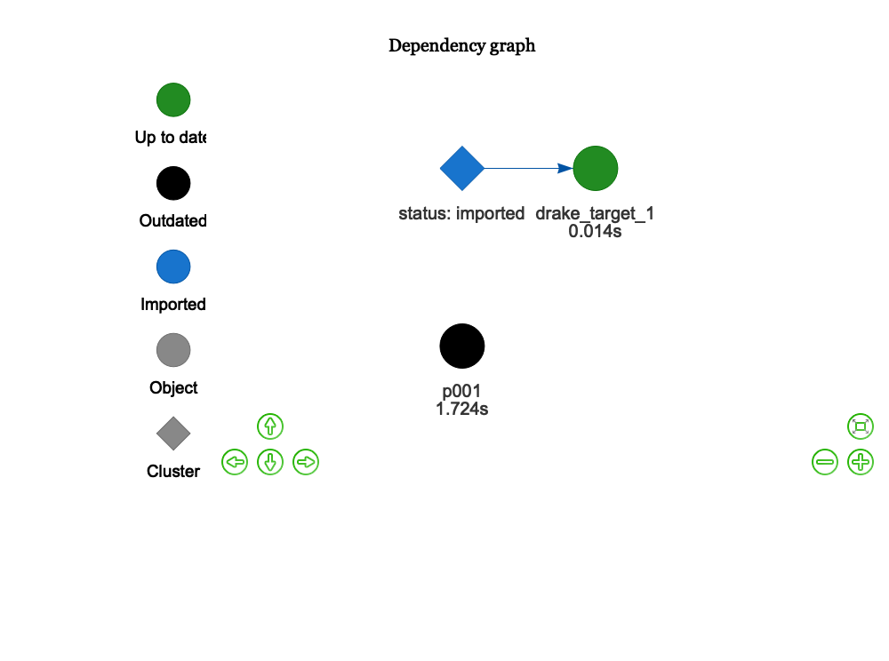
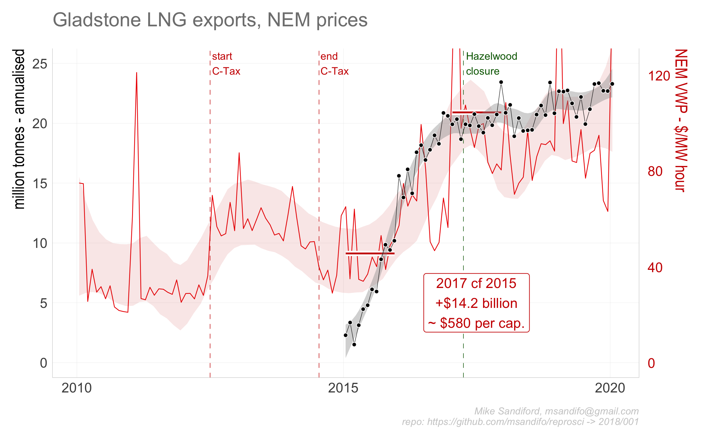
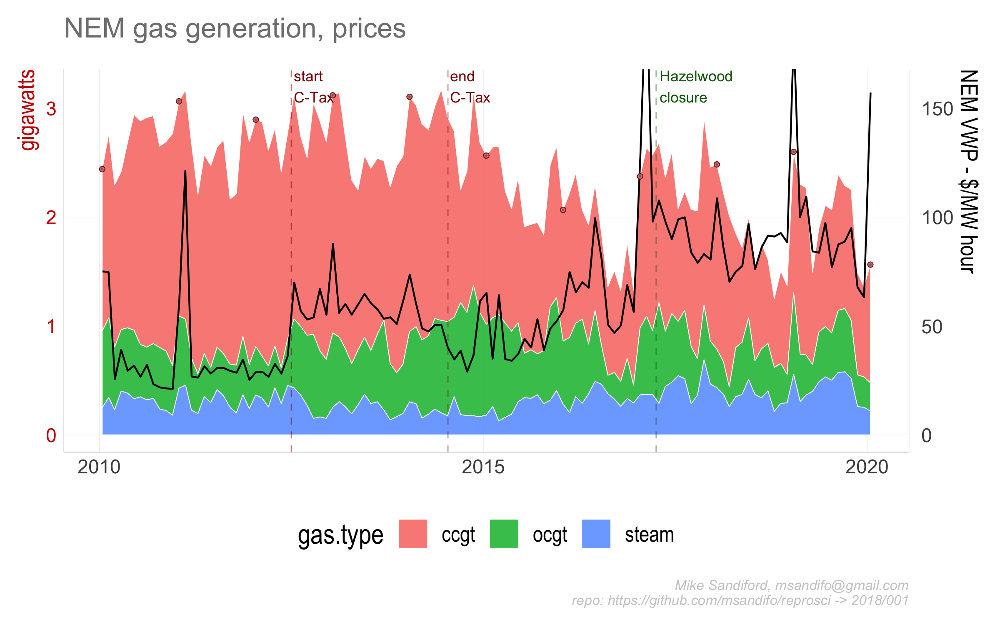
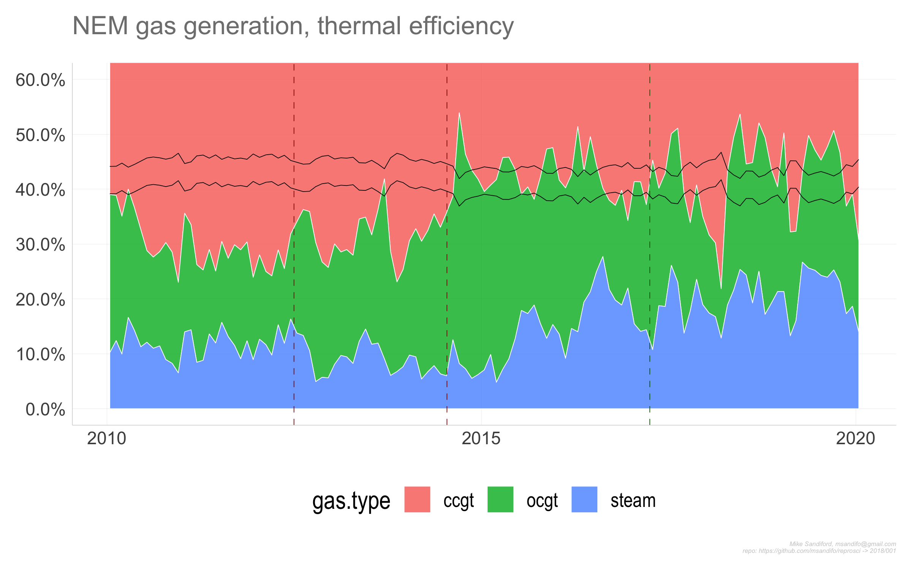

reprosci001
================

## Gladstone LNG

Amongst the many factors that caused Australian east coast electricity
wholesale prices to double ind 2016 was the opening of the east coast
gas market to internatinal LNG exports, via the Port of Gladstone. Here
I explore atime series of Gladstone Port Authority LNG export volumes,
and NEM market dispatch prices to illustrate the correlations. LNG
exports are expresed in annualised tonneage. NEM market prices are in
AUD$ per megawatt hour.

## Data Sources

LNG epxorts data are sourced from the [Gladstone Port Authority (GPA)
website](http://content1.gpcl.com.au/viewcontent/CargoComparisonsSelection/CargoComparisonsSelection.aspx).

NEM electricity prices are sourced from AEMO’s half hourly price and
demand csv files.

## Code

The code base is in `r` and is best managed with in managed within
RStudio, using the `drake` package.

#### Package dependencies

If not already installed, sourcing `'./src/functions.R'` automatically
installs the package dependencies `tidyverse`, `ggplot2`, `magrittr`,
`purrr`, `stringr`, `drake`, `lubridate`, `rvest`,
`rappdirs`,`data.table`, `fasttime`, `devtools`, `wbstats` from cran,
and `hrbrthemes` from the github repo `hrbrmstr/hrbrthemes`.

#### Setup

To start we set some variables, such as the `drake.path`, read in key
functions (including the drake plan `reproplan`) and adjust the ggplot
theme.

``` r
pkgconfig::set_config("drake::strings_in_dots" = "literals")
local.path=NULL
drake.path <- dirname(rstudioapi::getSourceEditorContext()$path )
setwd(drake.path)
source('./src/theme.R')
source('./src/functions.R')
source('./src/plan.R')
```

#### Downloads

``` r
source('./src/downloads.R')
```

directs the downlaod of the AEMO csv data files to be downloaded into
the local directory set by `local.path` By default `local.path=NULL` in
which case data is downloaded via `rappdirs::user_cache_dir()` to a
folder in the users cache directory (for macOSX, `~/Library/cache`) to
`file.path(local.path, aemo)`. `'./src/downloads.R'` is a wrapper on the
function
calls

``` r
download_aemo_aggregated(year=2010:2018, months=1:12, local.path=local.path)
download_aemo_current( local.path=local.path )
```

#### Drake plan

The code is organised and run/update via drake plan `reproplan` (
sourced via `source('./src/plan.R')`)

``` r
drake::make( reproplan, force=T)
```

The `reproplan` dependency structure can be easily visualised

``` r
config <- drake::drake_config(reproplan)
graph <- drake::drake_graph_info(config, group = "status", clusters = "imported")
drake::render_drake_graph(graph, file="figs/rmd_render_drake.png")
```



Note that `reproplan` includes

  - the directive `lng = update_gladstone( local.path=local.path)` which
    either reads the Gladstone export data from the relevant GPA html
    tables as a data.frame and stores `lng` to disk in
    `load(file.path(validate_directory(local.path, "gladstone"),
    "lng.Rdata"))` or, if already downloaded,
    `load(file.path(validate_directory(local.path, "gladstone"),
    "lng.Rdata"))`- see code details.

  - statements to read the monthly AEMO csv files for each of the five
    NEM regions (NSW1, QLD1, SA1 TAS1, VIC1), and aggregate them as
    monthly `NEM.month` and annual `NEM.year` timeseries.

<!-- end list -->

    ## # A tibble: 6 x 5
    ## # Groups:   year [1]
    ##    year month date         RRP TOTALDEMAND
    ##   <dbl> <dbl> <date>     <dbl>       <dbl>
    ## 1  2010     1 2010-01-16  75.0      23916.
    ## 2  2010     2 2010-02-14  74.8      24549.
    ## 3  2010     3 2010-03-16  25.6      23265.
    ## 4  2010     4 2010-04-15  39.0      22157.
    ## 5  2010     5 2010-05-16  29.5      23156.
    ## 6  2010     6 2010-06-15  31.7      24560.

    ## # A tibble: 6 x 4
    ##    year date         RRP TOTALDEMAND
    ##   <dbl> <date>     <dbl>       <dbl>
    ## 1  2010 2010-07-01  35.5     116680.
    ## 2  2011 2011-07-01  40.0     114661.
    ## 3  2012 2012-06-30  44.6     111575.
    ## 4  2013 2013-07-01  60.3     108779.
    ## 5  2014 2014-07-01  47.8     107519.
    ## 6  2015 2015-07-01  45.6     108735.

#### Output

The code generates three charts, output to `./figs` directory :

``` r
ggsave("./figs/p001_01.png",   p001$p1 ,width=8, height=5) 
ggsave("./figs/p001_02.png",    p001$p2 ,width=8, height=5) 
ggsave("./figs/p001_03.png",   p001$p3,width=8, height=5) 
```





## Code details

### Gladstone Port Authority (GPA)

The function call

`read_gladstone_ports<- function(year=NULL, month=NULL,fuel="Liquefied
Natural Gas", country="Total")`

scrapes data from the GPA html tables, utilising the package `rvest`,
noting that other commodities exported through the GPA, such as
`"Coal"`, can also be specified.

In our drake file, `read_gladstone_ports` is only indirectly called via
the function `update_gladstone`

## Errata
