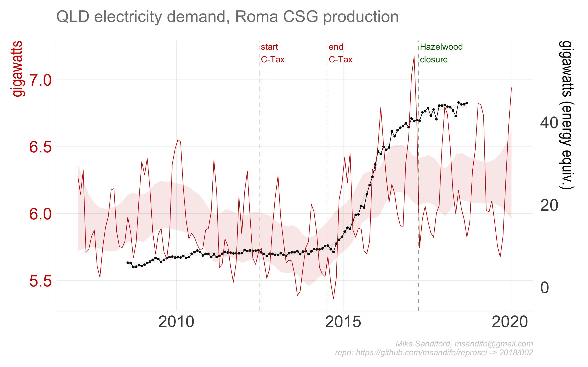

```{r setup, include=FALSE}

knitr::opts_chunk$set(echo = FALSE,  message=FALSE, warning=FALSE)
 
drake.path<-"~/Dropbox/msandifo/documents/programming/r/twitter/2018/002/"
full.repro<-F
library(reproscir)
source('./src/settings.R')
source('./src/theme.R')
source('./src/functions.R')
source('./src/plan.R')
#load(paste0(drake.path, "/data/data.Rdata"))
source('./src/downloads.R')

```
#### Updates

###### 11-October

* update - output  now shows  Roma CSG  production (AEMO Gas Bulletin Board data)

* original - used Gladstone Port LNG export cargo data 

##  LNG and coal seam gas impacts on electricity demand in Queensland

Amongst the many factors that caused Australian east coast electricity wholesale prices to double ind 2016 was the opening of the east coast gas market to internatinal LNG exports, via the Port of Gladstone. The as production uses to support the LNG exprst comes form the Coal Seam Gas fields at Roma.
Here I explore  a time series of ~~Gladstone Port Authority LNG export volumes~~ QLD CSG production volumes, and QLD NEM market demand to illustrate the correlations.

Both CSG production and NEM demand  in megawatts, in the former by converting the standard TJ/day by  a factor of ```r reproscir::tjday_to_mw(1)```

 

## Data Sources

Roma CSG production data sis derievd form AEMO's archived [Gas Services Buletin Board actual flows dataset](https://www.aemo.com.au/-/media/Files/Gas/Natural_Gas_Services_Bulletin_Board/2018/GBB-2018-Docs/Archived-Data/ActualFlows.zip)

~~~LNG epxort data are sourced from the [Gladstone Port Authority (GPA)  website](http://content1.gpcl.com.au/viewcontent/CargoComparisonsSelection/CargoComparisonsSelection.aspx).~~~

NEM demand are sourced from AEMO's half hourly price and demand csv files.


## Code

The code base is in ```r``` and is best managed with in managed within RStudio, using   the ```drake``` package.

#### Package dependencies

If not already installed, sourcing ```'./src/functions.R'``` automatically installs the package dependencies 
```tidyverse```, ```ggplot2```, ```magrittr```, ```purrr```, ```stringr```, ```drake```, ```lubridate```, ```rvest```, ```rappdirs```,```data.table```, ```fasttime```, ```devtools```, ```wbstats``` , ```zoo```
 from cran, and ```hrbrthemes``` from the github repos ```hrbrmstr/hrbrthemes``` and ```msandifo/reproscir```


#### Setup

To start we  set some variables, such as the ```drake.path```, read in key functions (including the drake plan ```reproplan```) and adjust the ggplot theme.

```{r echo=T, eval=F}
source('./src/settings.R')
source('./src/theme.R')
source('./src/functions.R')
source('./src/plan.R')
source('./src/plots.R')
 
``` 

#### Downloads
 
```{r echo=T, eval=F} 
source('./src/downloads.R')
``` 

directs the downlaod of the  AEMO csv data files to be downloaded  into the local directory set by 
``` local.path```
By default ``` local.path=NULL``` in which case data is downloaded via ```rappdirs::user_cache_dir()``` to a folder in the users cache directory (for macOSX, ```~/Library/cache```) to ```file.path(local.path, aemo)```.  ```'./src/downloads.R'```  is a wrapper on the function calls

```{r echo=T, eval=F}
reproscir::download_aemo_aggregated(year=2007:2018, months=1:12, local.path=local.path)
```
AEMO GSBB data set is downlaoded, read and muatted with
```{r echo=T, eval=F}
gasbb <- reproscir::download_gasbb() %>%  
    reproscir::read_gasbb( ) %>% 
     reproscir::group_gasbb("Roma") %>% 
    dplyr::mutate(year= lubridate::year(gasdate), month= lubridate::month(gasdate)) %>%
    dplyr::group_by(year,month) %>%
    dplyr::summarise(date=mean(gasdate), TOTALDEMAND = mean(reproscir::tjday_to_mw(actualquantity)))

```


#### Drake plan

The code is organised and run/update via drake plan ```reproplan``` ( sourced via ```source('./src/plan.R')```)

```{r echo=T, eval=F}
drake::make( reproplan, force=T)
```

The ```reproplan``` dependency structure can be easily visualised 
```{r drake_plan, echo=TRUE, cache=T}
config <- drake::drake_config(reproplan)
graph <- drake::drake_graph_info(config, group = "status", clusters = "imported")
drake::render_drake_graph(graph, file="figs/rmd_render_drake.png")
```


Note that ```reproplan``` includes 

* the directive ```lng = update_gladstone( local.path=local.path)``` which either reads the Gladstone export data from the relevant GPA html tables as a data.frame  and stores ```lng``` to disk in   ```load(file.path(validate_directory(local.path, "gladstone"), "lng.Rdata"))``` or, if already downloaded, ```load(file.path(validate_directory(local.path, "gladstone"), "lng.Rdata"))```- see code details.


* statements to read the monthly AEMO csv files for each of the NEM region QLD1, and aggregate them as monthly ```QLD.month```  timeseries. 

```{r  cache=FALSE}
print(head(readd(QLD.month)))

```

 


#### Output

Output charts using ```ggplot``` are saved to the ```./figs``` directory :

```{r  echo=TRUE, cache=TRUE}
p002<-drake::readd(p002)
ggsave("./figs/p002_01.png",  p002$p1 ,width=8, height=5) 
ggsave("./figs/p002_01o.png",  p002$p1.o ,width=8, height=5) 
```


where ```./figs/p002_01o.png``` is the original


## Code details

### Gladstone Port Authority (GPA)

The function call

``` read_gladstone_ports(year=NULL, month=NULL,fuel="Liquefied Natural Gas", country="Total")```

scrapes data from the GPA html tables, utilising the package ```rvest```, noting that other commodities exported through the GPA, such as ```"Coal"```, can also be specified.
TThe function call

read_gladstone_ports<- function(year=NULL, month=NULL,fuel="Liquefied Natural Gas", country="Total")

scrapes data from the GPA html tables, utilising the package rvest, noting that other commodities exported through the GPA, such as "Coal", can also be specified.

The drake plan indirectly calls ```read_gladstone_ports``` via ```update_gladstone```

#### NEM data

While the monthly NEM csv files have time stamps ```SETTLEMENTDATE``` ordered ```ymd hms```, the September 2016 csv files have time stamps reversed ```dmy hms```. The function ```dmy_to_ymd``` reorders the time stamps to ``ymd hms```.


NEM data

While the monthly NEM csv files have time stamps SETTLEMENTDATE ordered ymd hms, the September 2016 csv files have time stamps reversed dmy hms. The function dmy_to_ymd reorders the time stamps.


## Errata
