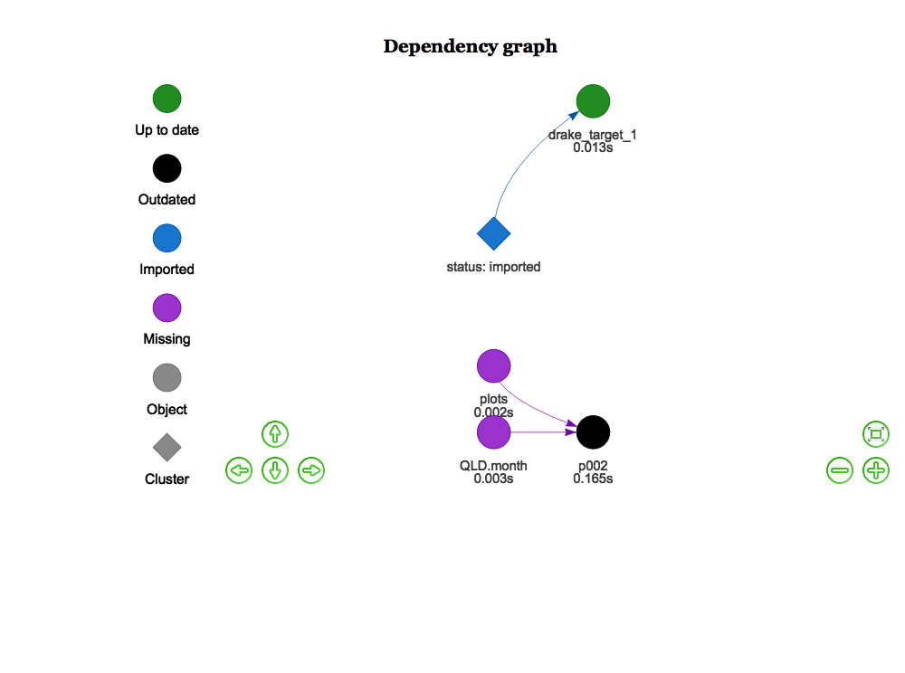
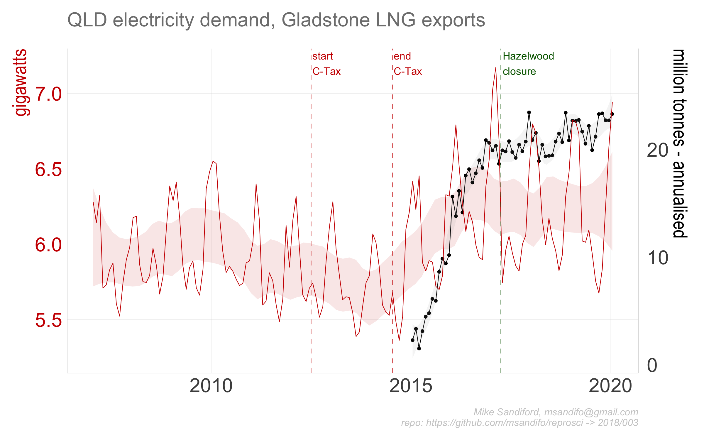

002
================

#### Updates

###### 11-October

  - update - output now shows Roma CSG production (AEMO Gas Bulletin
    Board data)

  - original - used Gladstone Port LNG export cargo data

## LNG and coal seam gas impacts on electricity demand in Queensland

Amongst the many factors that caused Australian east coast electricity
wholesale prices to double in 2016 was the opening of the east coast gas
market to internatinal LNG exports, via the Port of Gladstone. The gas
production supporting LNG export comes from the Coal Seam Gas (CSG)
fields in the Roma production zone in QLD. Here I explore a time series
of ~~Gladstone Port Authority LNG export volumes~~ Roma CSG production
volumes, and QLD NEM market demand to illustrate the correlations.

Both CSG production and NEM demand in megawatts, in the former by
converting the standard TJ/day by a factor of `11.5740741`

## Data Sources

Roma CSG production data is derievd from AEMO’s archived [Gas Services
Bulletin Board actual
flows](https://www.aemo.com.au/Gas/Gas-Bulletin-Board)

\~~~LNG epxort data are sourced from the [Gladstone Port Authority (GPA)
website](http://content1.gpcl.com.au/viewcontent/CargoComparisonsSelection/CargoComparisonsSelection.aspx).~~\~

NEM demand are sourced from AEMO’s half hourly price and demand csv
files.

## Code

The code base is in `r` and is best managed with in managed within
RStudio, using the `drake` package.

#### Package dependencies

If not already installed, sourcing `'./src/functions.R'` automatically
installs the package dependencies `tidyverse`, `ggplot2`, `magrittr`,
`purrr`, `stringr`, `drake`, `lubridate`, `rvest`,
`rappdirs`,`data.table`, `fasttime`, `devtools`, `wbstats` , `zoo` from
cran, and `hrbrthemes` from the github repos `hrbrmstr/hrbrthemes` and
`msandifo/reproscir`

#### Setup

To start we set some variables, such as the `drake.path`, read in key
functions (including the drake plan `reproplan`) and adjust the ggplot
theme.

``` r
source('./src/settings.R')
source('./src/theme.R')
source('./src/functions.R')
source('./src/plan.R')
source('./src/plots.R')
```

#### Downloads

``` r
source('./src/downloads.R')
```

directs the downlaod of the AEMO csv data files to be downloaded into
the local directory set by `local.path` By default `local.path=NULL` in
which case data is downloaded via `rappdirs::user_cache_dir()` to a
folder in the users cache directory (for macOSX, `~/Library/cache`) to
`file.path(local.path, aemo)`. `'./src/downloads.R'` is a wrapper on the
function
calls

``` r
reproscir::download_aemo_aggregated(year=2007:2018, months=1:12, local.path=local.path)
```

AEMO GASBB data set is downlaoded, read and muatted with

``` r
gasbb <- reproscir::download_gasbb() %>%  
    reproscir::read_gasbb( ) %>% 
     reproscir::group_gasbb("Roma") %>% 
    dplyr::mutate(year= lubridate::year(gasdate), month= lubridate::month(gasdate)) %>%
    dplyr::group_by(year,month) %>%
    dplyr::summarise(date=mean(gasdate), TOTALDEMAND = mean(reproscir::tjday_to_mw(actualquantity)))
```

#### Drake plan

The code is organised and run/update via drake plan `reproplan` (
sourced via `source('./src/plan.R')`)

``` r
drake::make( reproplan, force=T)
```

The `reproplan` dependency structure can be easily visualised

``` r
config <- drake::drake_config(reproplan)
graph <- drake::drake_graph_info(config, group = "status", clusters = "imported")
drake::render_drake_graph(graph, file="figs/rmd_render_drake.png")
```



Note that `reproplan` includes

  - the directive `lng = update_gladstone( local.path=local.path)` which
    either reads the Gladstone export data from the relevant GPA html
    tables as a data.frame and stores `lng` to disk in
    `load(file.path(validate_directory(local.path, "gladstone"),
    "lng.Rdata"))` or, if already downloaded,
    `load(file.path(validate_directory(local.path, "gladstone"),
    "lng.Rdata"))`- see code details.

  - statements to read the monthly AEMO csv files for each of the NEM
    region QLD1, and aggregate them as monthly `QLD.month` timeseries.

<!-- end list -->

    ## # A tibble: 6 x 5
    ## # Groups:   year [1]
    ##    year month date         RRP TOTALDEMAND
    ##   <dbl> <dbl> <date>     <dbl>       <dbl>
    ## 1  2007     1 2007-01-16  86.0       6281.
    ## 2  2007     2 2007-02-14  39.9       6143.
    ## 3  2007     3 2007-03-16  51.2       6322.
    ## 4  2007     4 2007-04-15  78.8       5708.
    ## 5  2007     5 2007-05-16  63.0       5731.
    ## 6  2007     6 2007-06-15 218.        5830.

#### Output

Output charts using `ggplot` are saved to the `./figs` directory :

``` r
p002<-drake::readd(p002)
ggsave("./figs/p002_01.png",  p002$p1 ,width=8, height=5) 
ggsave("./figs/p002_01o.png",  p002$p1.o ,width=8, height=5) 
```


where `./figs/p002_01o.png` is the original


## Code details

### Gladstone Port Authority (GPA)

The function call

`read_gladstone_ports(year=NULL, month=NULL,fuel="Liquefied Natural
Gas", country="Total")`

scrapes data from the GPA html tables, utilising the package `rvest`,
noting that other commodities exported through the GPA, such as
`"Coal"`, can also be specified. TThe function call

read\_gladstone\_ports\<- function(year=NULL, month=NULL,fuel=“Liquefied
Natural Gas”, country=“Total”)

scrapes data from the GPA html tables, utilising the package rvest,
noting that other commodities exported through the GPA, such as “Coal”,
can also be specified.

The drake plan indirectly calls `read_gladstone_ports` via
`update_gladstone`

#### NEM data

While the monthly NEM csv files have time stamps `SETTLEMENTDATE`
ordered `ymd hms`, the September 2016 csv files have time stamps
reversed `dmy hms`. The function `dmy_to_ymd` reorders the time stamps
to \`\`ymd hms\`\`\`.

NEM data

While the monthly NEM csv files have time stamps SETTLEMENTDATE ordered
ymd hms, the September 2016 csv files have time stamps reversed dmy hms.
The function dmy\_to\_ymd reorders the time stamps.

## Errata
