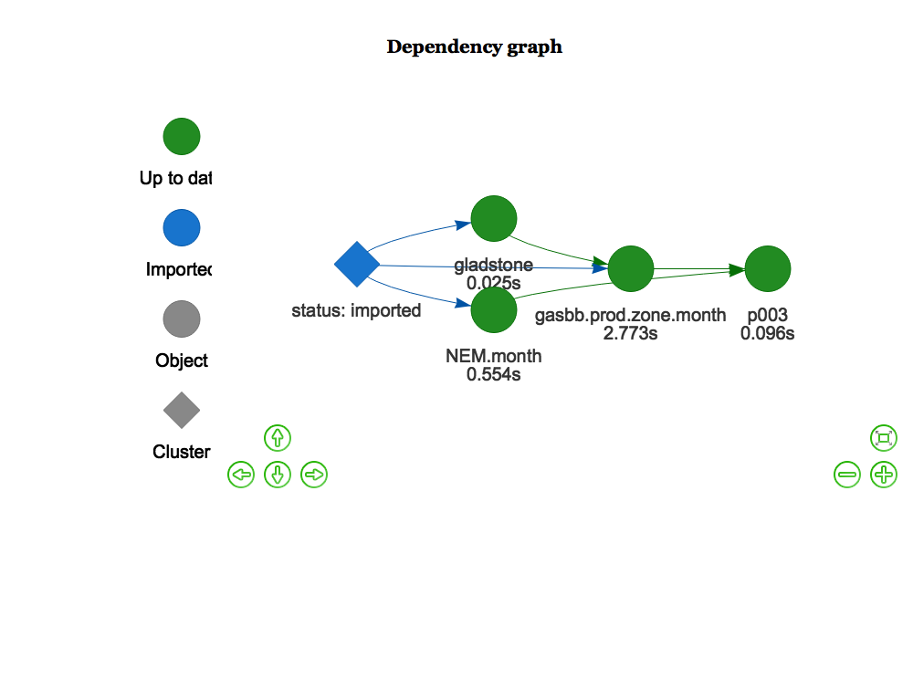
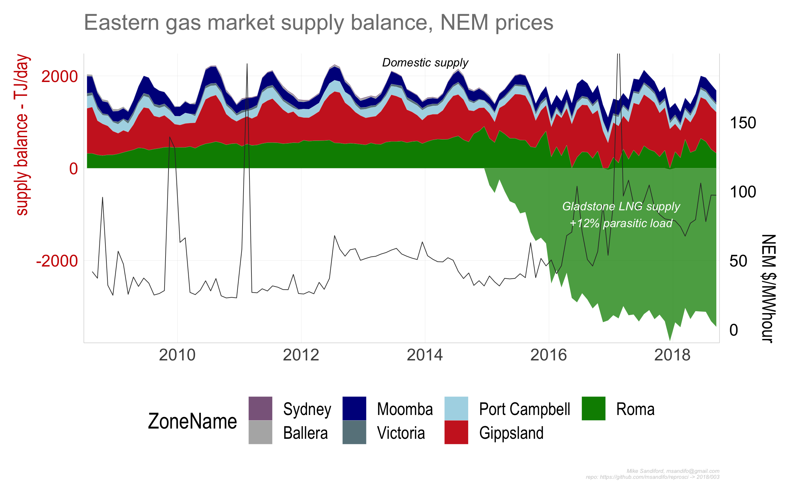

003
================

## East Coast gas market supply balance and NEM prices

Amongst the many factors that caused Australian east coast electricity
wholesale prices to double in 2016 was the opening of the east coast gas
market to internatinal LNG exports, via the Port of Gladstone. This has
affected the supply balance of the easty coast gas market, as the gas
production supporting LNG export from the Coal Seam Gas (CSG) fields in
the Roma production zone in QLD, changes the supply mix into the doemtoc
market. Here I explore a time series of Gladstone Port Authority LNG
export volume, Roma CSG production volumes, and NEM market prices.

Gas production is in TJ/day and NEM prices in AUD$

## Data Sources

  - East coast gas market production data is derived from AEMO’s now
    archived [Gas Services Bulletin Board actual
    flows](https://www.aemo.com.au/Gas/Gas-Bulletin-Board)

  - LNG export data are sourced from the [Gladstone Port Authority (GPA)
    website](http://content1.gpcl.com.au/viewcontent/CargoComparisonsSelection/CargoComparisonsSelection.aspx)

  - NEM demand are sourced from AEMO’s half hourly price and demand csv
    files.

## Caveats

This repo contains a preprocessed dataset `./data/facility.Rdata`,
containing GASBB facility data. Due to an uprgading of AEMO’s GASBB data
reprository this not - at the time of preparation - straightforward to
reproduce from the raw data. The `gasbb.facility` data.frame contains
the following info

PlantID, PlantName, PlantType, Zone, OperatorName, LowRange, HiRange,
Exempt, GasDayStartHour, ZoneId, OperatorId, LastUpdated, ReportDateTime

with `gasbb.facility$PlantType` used to select the production, as
opposed to pipelines and storage, facilities needed to extract a supply
balance from AEMO’s archived [Gas Services Bulletin Board actual
flows](https://www.aemo.com.au/Gas/Gas-Bulletin-Board) data.

## Code

The code base is in `r` and is best managed with in managed within
RStudio, using the `drake` package.

#### Package dependencies

If not already installed, sourcing `'./src/functions.R'` automatically
installs the package dependencies `tidyverse`, `ggplot2`, `magrittr`,
`purrr`, `stringr`, `drake`, `lubridate`, `rvest`,
`rappdirs`,`data.table`, `fasttime`, `devtools`, `wbstats` , `zoo` from
cran, and `hrbrthemes` from the github repos `hrbrmstr/hrbrthemes` and
`msandifo/reproscir`

#### Setup

To start we set some variables, such as the `drake.path`, read in key
functions (including the drake plan `reproplan`) and adjust the ggplot
theme.

``` r
source('./src/settings.R')
source('./src/theme.R')
source('./src/functions.R')
source('./src/plan.R')
source('./src/plots.R')
```

#### Downloads

``` r
source('./src/downloads.R')
```

directs the downlaod of the AEMO csv data files to be downloaded into
the local directory set by `local.path` By default `local.path=NULL` in
which case data is downloaded via `rappdirs::user_cache_dir()` to a
folder in the users cache directory (for macOSX, `~/Library/cache`) to
`file.path(local.path, aemo)`. `'./src/downloads.R'` is a wrapper on the
function
calls

``` r
reproscir::download_aemo_aggregated(year=2007:2018, months=1:12, local.path=local.path)
```

AEMO GASBB data set is downlaoded, read

``` r
gasbb <- reproscir::download_gasbb() %>%  
    reproscir::read_gasbb( ) 
```

and then mutated and joined with theLNG data (see `./src/dowwnloads.R`)

#### Drake plan

The code is organised and run/update via drake plan `reproplan` (
sourced via `source('./src/plan.R')`)

``` r
drake::make( reproplan, force=T)
```

The `reproplan` dependency structure

``` r
config <- drake::drake_config(reproplan)
graph <- drake::drake_graph_info(config, group = "status", clusters = "imported")
drake::render_drake_graph(graph, file="figs/rmd_render_drake.png")
```



Note that `reproplan` loads the `./data/data.Rdata` built by
`./src/downloads.R`, returning `Nem.month`

    ## # A tibble: 6 x 5
    ## # Groups:   year [1]
    ##    year month date         RRP TOTALDEMAND
    ##   <dbl> <dbl> <date>     <dbl>       <dbl>
    ## 1  2008     1 2008-01-16  36.4      44537.
    ## 2  2008     2 2008-02-15  28.1      43353.
    ## 3  2008     3 2008-03-16  37.4      42966.
    ## 4  2008     4 2008-04-15  34.5      42901.
    ## 5  2008     5 2008-05-16  46.9      45248.
    ## 6  2008     6 2008-06-15  43.9      46719.

and \`\`\`gasbb.prod.zone.month\`\`\`\`

    ## # A tibble: 6 x 6
    ## # Groups:   ZoneName, month [6]
    ##   ZoneName      month  year actualquantity gasdate     roma
    ##   <ord>         <dbl> <dbl>          <dbl> <date>     <dbl>
    ## 1 Ballera           7  2008           39.8 2008-07-15     0
    ## 2 Gippsland         7  2008          978.  2008-07-15     0
    ## 3 Moomba            7  2008          371.  2008-07-15     0
    ## 4 Port Campbell     7  2008          262.  2008-07-15     0
    ## 5 Roma              7  2008          320.  2008-07-15     0
    ## 6 Victoria          7  2008           65.3 2008-07-15     0

where `gasbb.prod.zone.month$lng` is the component of `Roma` prodcution
directed towards Gladstone LNG exports, assuming a 12% parasitic load
applies (i.e. the gas used for LNG transport and compression, CSG
produced water treatments etc. )

#### Output

Output charts using `ggplot` are saved to the `./figs` directory :

``` r
p003<-drake::readd(p003)
ggsave("./figs/p003_01.png",  p003$p1 ,width=8, height=5) 
```



## Code details

### Gladstone Port Authority (GPA)

The function call

`read_gladstone_ports(year=NULL, month=NULL,fuel="Liquefied Natural
Gas", country="Total")`

scrapes data from the GPA html tables, utilising the package `rvest`,
noting that other commodities exported through the GPA, such as
`"Coal"`, can also be specified. The function call

read\_gladstone\_ports\<- function(year=NULL, month=NULL,fuel=“Liquefied
Natural Gas”, country=“Total”)

scrapes data from the GPA html tables, utilising the package rvest,
noting that other commodities exported through the GPA, such as “Coal”,
can also be specified.

The drake plan indirectly calls `read_gladstone_ports` via
`update_gladstone`

#### NEM data

While the monthly NEM csv files have time stamps `SETTLEMENTDATE`
ordered `ymd hms`, the September 2016 csv files have time stamps
reversed `dmy hms`. The function `dmy_to_ymd` reorders the time stamps
to `ymd hms`.

## Errata
