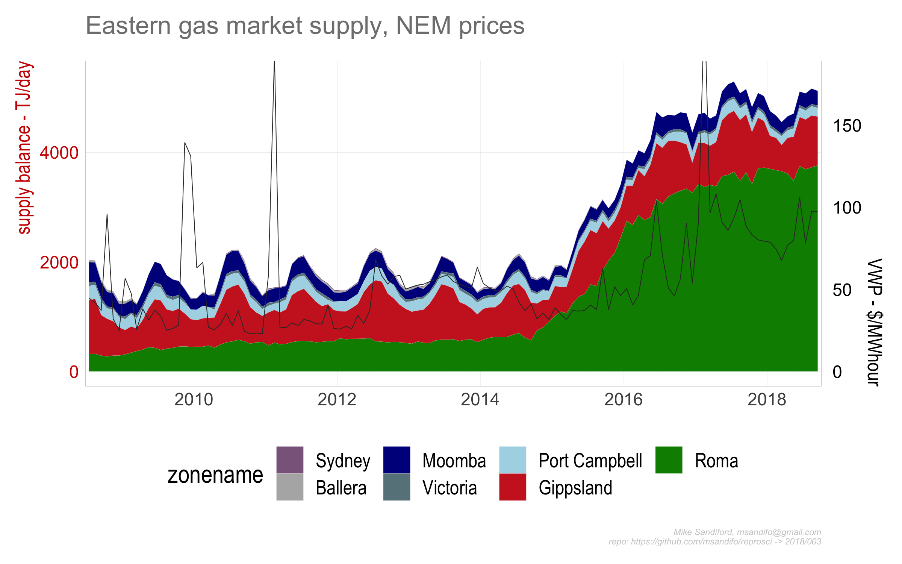

003
================

## East Coast gas market supply balance and NEM prices

The opening of the east coast gas market to international LNG exports,
via the Port of Gladstone, has been accompanied by a doubling Australian
east coast electricity wholesale prices. With gas production supporting
LNG export derived from the Coal Seam Gas (CSG) fields in the Roma
production zone in QLD, there have been consequences for the supply mix
into the domestic market. Here I explore time series for Gladstone Port
Authority LNG export volumes, east coast production volumes, and NEM
market prices.

Gas production is in TJ/day and NEM prices are in $AUD/MWhour and
expressed as Volume weighted terms (VWP).

There are no public data relevant to the proportion of Roma CSG gas
production used in LNG compression and liquefaction and associated CSG
activities. I assume a value of 12% for the parastitc load, which can be
changed by setting the `parasitic.load` in the `drake.R` file.

`parasitic.load=12`

## Data Sources

  - East coast gas market production data is derived from AEMO’s now
    archived [Gas Services Bulletin Board actual
    flows](https://www.aemo.com.au/Gas/Gas-Bulletin-Board)

  - LNG export data are sourced from the [Gladstone Port Authority (GPA)
    website](http://content1.gpcl.com.au/viewcontent/CargoComparisonsSelection/CargoComparisonsSelection.aspx)

  - NEM demand are sourced from AEMO’s half hourly price and demand csv
    files.

## Caveats

This repo contains a preprocessed dataset `./data/facility.Rdata`,
containing GASBB facility data. Due to an uprgading of AEMO’s GASBB data
reprository this not - at the time of preparation - straightforward to
reproduce from the raw data. The `gasbb.facility` data frame contains
the following columns

PlantID, PlantName, PlantType, Zone, OperatorName, LowRange, HiRange,
Exempt, GasDayStartHour, ZoneId, OperatorId, LastUpdated, ReportDateTime

with `gasbb.facility$PlantType` used to select the production, as
opposed to pipelines and storage, facilities needed to extract a supply
balance from AEMO’s archived [Gas Services Bulletin Board actual
flows](https://www.aemo.com.au/Gas/Gas-Bulletin-Board) data.

## Code

The code base is in `r` and is managed within RStudio, using the `drake`
package, and my `reoproscir` package on `github`.

The code can be executed by opening the `Rstudio` project `003.Rproj`
and sourcing `drake.R`.

``` r
source('drake.R')
```

Details of the steps invoked by \`\``drake.R` are summarised below.

  - `source('./src/packages.R')` checks for and automatically installs
    missing package dependencies
    <!-- ```tidyverse```, ```ggplot2```, ```magrittr```, ```purrr```, ```stringr```, ```drake```, ```lubridate```, ```rvest```, ```rappdirs```,```data.table```, ```fasttime```, ```devtools```, ```wbstats```  -->
    <!--  from cran, and ```hrbrthemes```  and ```reproscir``` from the github repos ```hrbrmstr/hrbrthemes``` and ```msandifo/reproscir``` -->

  - `source('./src/settings.R')` sets variables, such as the
    `drake.path`,

  - `source('./src/functions.R')` reads in data processing functions not
    in `reproscir`

  - `source('./src/theme.R')` sets the ggplot theme derived from
    `hrbrthemes`

  - `source('./src/plots.R')` plot functions  

  - `source('./src/downloads.R')` directs the download of the relevant
    data files to be downloaded into the local directory set by
    `local.path`. By default `local.path=NULL` in which case data is
    downloaded via `rappdirs::user_cache_dir()` to a folder in the users
    cache directory (for macOSX, `~/Library/cache`) to
    `file.path(local.path, aemo)`.

  - `source('./src/plan.R')` defines the drake plan `reproplan` with the
    dependency structure

<!-- end list -->

``` r
parasitic.load=12
source('./src/settings.R')
source('./src/theme.R')
source('./src/functions.R')
source('./src/plots.R')
source('./src/plan.R')
drake::make( reproplan )
config <- drake::drake_config(reproplan)
graph <- drake::drake_graph_info(config, group = "status", clusters = "imported")
drake::render_drake_graph(graph, file="figs/rmd_render_drake.png")
```


Note that `reproplan` loads the `./data/data.Rdata` built by
`./src/downloads.R`, returning `Nem.month`

    ## # A tibble: 6 x 5
    ## # Groups:   year [1]
    ##    year month date         VWP TOTALDEMAND
    ##   <dbl> <dbl> <date>     <dbl>       <dbl>
    ## 1  2008     1 2008-01-16  36.4      44537.
    ## 2  2008     2 2008-02-15  28.1      43353.
    ## 3  2008     3 2008-03-16  37.4      42966.
    ## 4  2008     4 2008-04-15  34.5      42901.
    ## 5  2008     5 2008-05-16  46.9      45248.
    ## 6  2008     6 2008-06-15  43.9      46719.

and `gasbb.prod.zone.month`

    ## # A tibble: 6 x 6
    ## # Groups:   zonename, month [6]
    ##   zonename      month  year actualquantity date       gladstone
    ##   <chr>         <dbl> <dbl>          <dbl> <date>         <dbl>
    ## 1 Ballera           7  2008           39.8 2008-07-15         0
    ## 2 Gippsland         7  2008          978.  2008-07-15         0
    ## 3 Moomba            7  2008          371.  2008-07-15         0
    ## 4 Port Campbell     7  2008          262.  2008-07-15         0
    ## 5 Roma              7  2008          320.  2008-07-15         0
    ## 6 Victoria          7  2008           65.3 2008-07-15         0

where `gasbb.prod.zone.month$gladstone` is the component of `Roma`
production directed to Gladstone LNG exports, assuming a parasitic load
applies (i.e. the gas used for LNG transport and compression, CSG
produced water treatments etc. ) as set by `parasitic.load`

  - \``source(drake::make( reproplan ))`

  - `source('./src/ouputs.R')` output charts to the `./figs` directory :

<!-- end list -->

``` r
p003<-drake::readd(p003)
ggsave("./figs/p003_01.png",  p003$p1 ,width=8, height=5) 
ggsave("./figs/p003_02.png",  p003$p2 ,width=8, height=5) 
NEM.month <- drake::readd(NEM.month)
gasbb.prod.zone.month <- drake::readd(gasbb.prod.zone.month)
gladstone<- drake::readd(gladstone)
save( NEM.month , gasbb.prod.zone.month, gladstone,  file = paste0(drake.path,"/data/data.Rdata"))
```




## Code Notes

### Gladstone Port Authority (GPA)

The function call

`reproscir::read_gladstone_ports(year=NULL, month=NULL,fuel="Liquefied
Natural Gas", country="Total")`

scrapes data from the GPA html tables, utilising the package `rvest`,
noting that other commodities exported through the GPA, such as
`"Coal"`, can also be specified.

The drake plan indirectly calls `reproscir::read_gladstone_ports` via
`reproscir::update_gladstone` in `get_gasbb_zone_month` in
`./src/functions.R`

#### NEM data

While the monthly NEM csv files have time stamps `SETTLEMENTDATE`
ordered `ymd hms`, the September 2016 csv files have time stamps
reversed `dmy hms`. The function `reproscir::dmy_to_ymd` reorders the
time stamps to `ymd hms`.

## Errata
