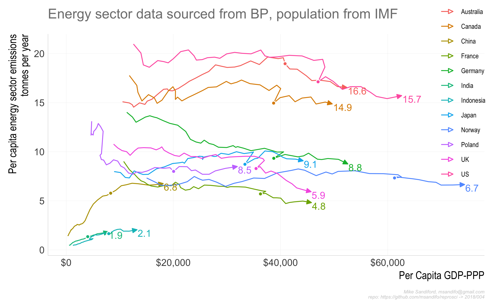
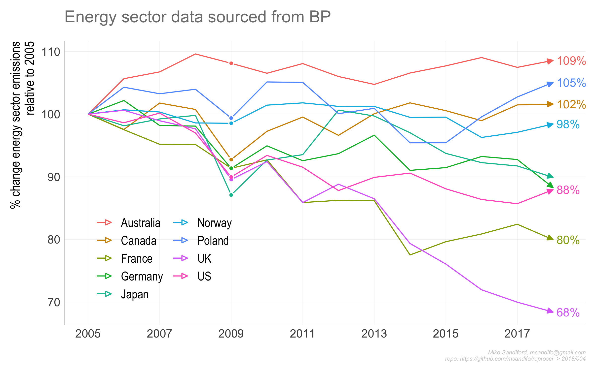

004
================

## Energy sector emissions

National comparisons of energy sector emissions as a fucntion of
economic and population indicators

## Data Sources

  - [BP statistical-review of energy, 2018
    edition](https://www.bp.com/content/dam/bp/en/corporate/excel/energy-economics/statistical-review/bp-stats-review-2018-all-data.xlsx)

  - [IMF world energy
    outlook](https://www.imf.org/external/pubs/ft/weo/2018/01/weodata/WEOApr2018all.xls)

## Caveats

## Code

The code base is in `r` and is managed within RStudio, using the `drake`
package, and my `reoproscir` package on `github` obtained with
`devtools::install_github("msandifo/reproscir")`. *Note this package is
very much a work in progress.*

The code can be executed by opening the `Rstudio` project `004.Rproj`
and sourcing `drake.R`.

``` r
source('drake.R')
```

Details of the steps invoked by \`\``drake.R` are summarised below.

  - `source('./src/packages.R')` checks for and automatically installs
    missing package dependencies
    <!-- ```tidyverse```, ```ggplot2```, ```magrittr```, ```purrr```, ```stringr```, ```drake```, ```lubridate```, ```rvest```, ```rappdirs```,```data.table```, ```fasttime```, ```devtools```, ```wbstats```  -->
    <!--  from cran, and ```hrbrthemes```  and ```reproscir``` from the github repos ```hrbrmstr/hrbrthemes``` and ```msandifo/reproscir``` -->

  - `source('./src/settings.R')` sets variables, such as the
    `drake.path`,

  - `source('./src/functions.R')` reads in data processing functions not
    in `reproscir`

  - `source('./src/theme.R')` sets the ggplot theme derived from
    `hrbrthemes`

  - `source('./src/plots.R')` plot functions  

  - `source('./src/downloads.R')` directs the download of the relevant
    data files to be downloaded into the local directory set by
    `local.path`. By default `local.path=NULL` in which case data is
    downloaded via `rappdirs::user_cache_dir()` to a folder in the users
    cache directory (for macOSX, `~/Library/cache`) to
    `file.path(local.path, aemo)`.

  - `source('./src/plan.R')` defines the drake plan `reproplan` with the
    dependency structure

<!-- end list -->

``` r
parasitic.load=12
source('./src/settings.R')
source('./src/theme.R')
source('./src/functions.R')
source('./src/plots.R')
source('./src/plan.R')
drake::make( reproplan )
config <- drake::drake_config(reproplan)
graph <- drake::drake_graph_info(config, group = "status", clusters = "imported")
drake::render_drake_graph(graph, file="figs/rmd_render_drake.png")
```


Note that `reproplan` porcesses the files downloaded by
`./src/downloads.R`, returning `merged.data`

    ##      region year value.x  value.y   value   perCap
    ## 1 Australia 1980  14.802 223.3988 155.129 15.09247
    ## 2 Australia 1981  15.039 225.1242 176.614 14.96936
    ## 3 Australia 1982  15.289 226.1770 187.689 14.79344
    ## 4 Australia 1983  15.484 225.1885 194.174 14.54330
    ## 5 Australia 1984  15.677 234.8467 213.825 14.98034
    ## 6 Australia 1985  15.901 235.7469 232.708 14.82592

  - `source(drake::make( reproplan ))`

  - `source('./src/ouputs.R')` output charts to the `./figs` directory :

<!-- end list -->

``` r
p004<-drake::readd(p004)
ggsave("./figs/p004_01.png",  p004$p1 ,width=8, height=5) 
ggsave("./figs/p004_02.png",  p004$p2 ,width=8, height=5) 
ggsave("./figs/p004_03.png",  p004$p2 ,width=8, height=5) 
```





## Code Notes

## Errata
