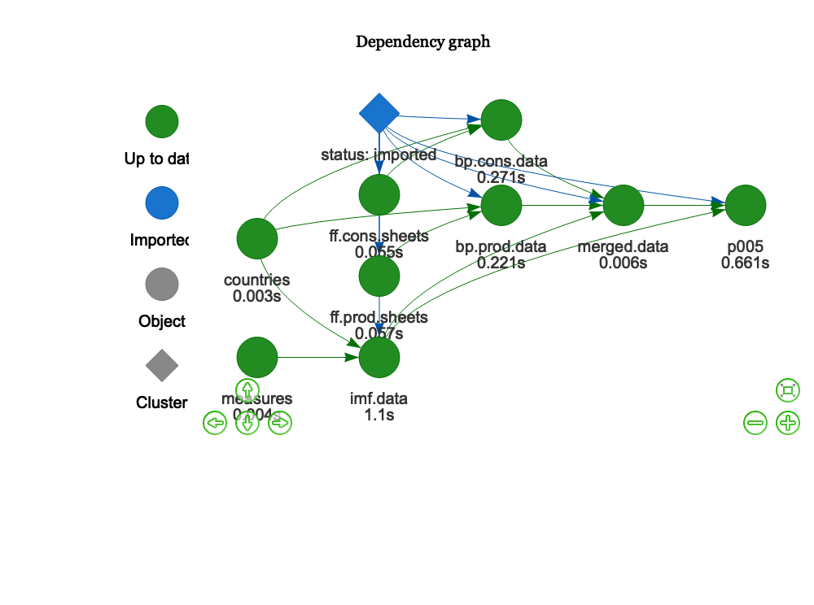
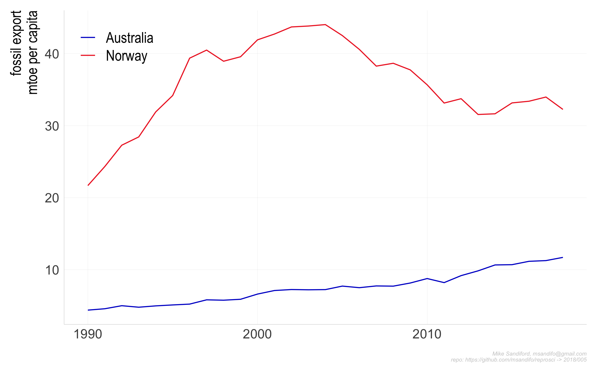
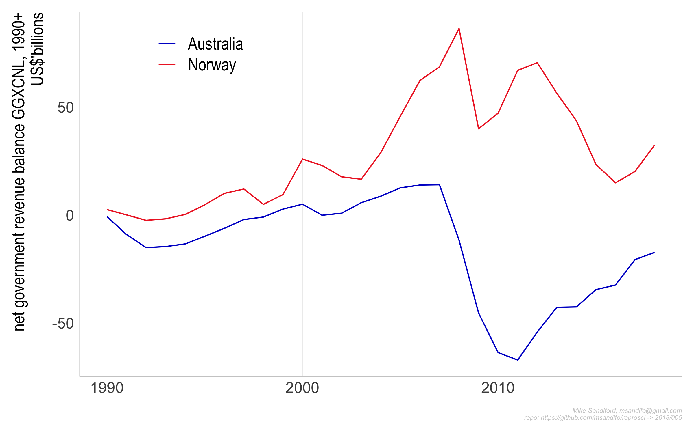
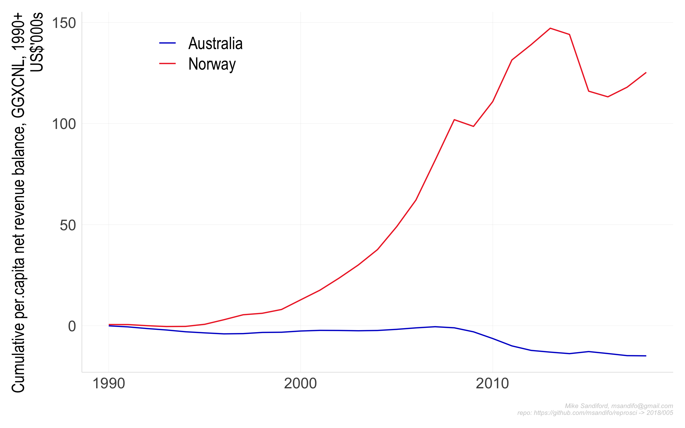
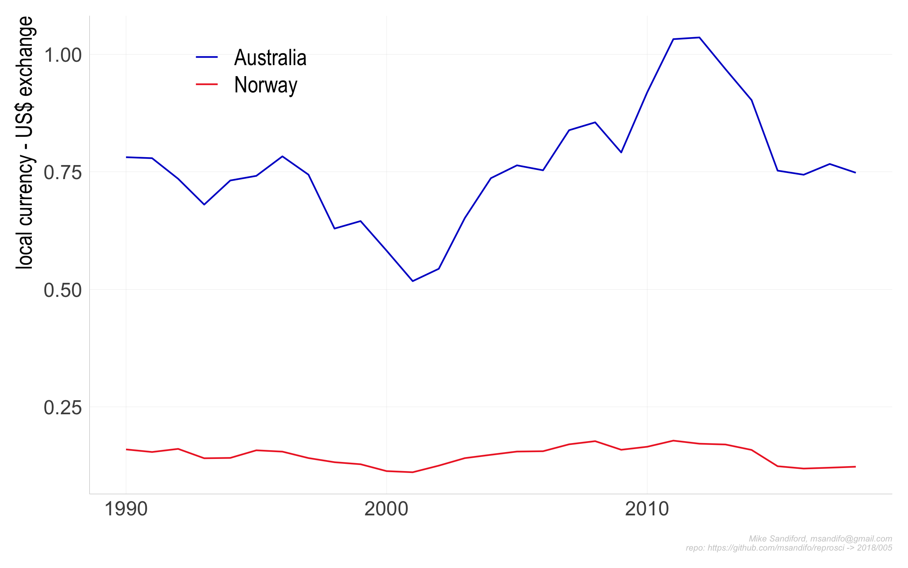
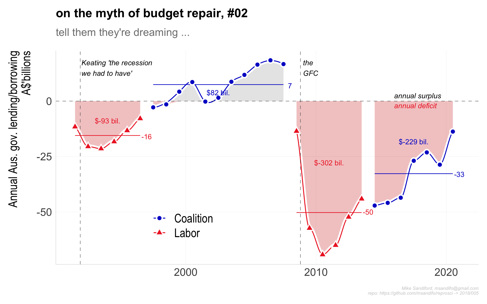

005
================

## Norway v Australia

Norway and Australia are both major exporters of fossil fuels. Since the
early 90’s Australian fossil energy exports have increased 270% measured
on an energy basis, whereas Norway has increased by 92%. Despite this,
the structural budget balances of the two countries have diverged
dramatically since the early 1990’s, in favour of Norway. Factors
include

  - rather different commodity mixes (more oil and gas in Norway, more
    coal in Australia which increasingly relies on net oil imports) and
    , more importantly,

  - very different petroleum/mineral royalty and taxation regimes (see
    [Paul Cleary’s *Trillion dollar baby*, BlackInc Books,
    2016](https://www.blackincbooks.com.au/books/trillion-dollar-baby)).

The analysis here uses open-sourced data to illustrate how energy
exports and government financial balances have evolved in both
countries. Key points:

  - Despite the 270% increase in fossil fuel exports (in energy
    equivalent terms) since 1990, Australia has accrued very significant
    structural deficit accumulating an interest bill of around US$12
    billion per year.

## Data Sources

  - [BP statistical-review of energy, 2018
    edition](https://www.bp.com/content/dam/bp/en/corporate/excel/energy-economics/statistical-review/bp-stats-review-2018-all-data.xlsx).
    The BP data is distributed as an Excel spreadsheet. Here I use the
    fossil fuel production and consumption data, aggregated in energy
    equivalent `mtoe` terms (million tonnes oil-equivalent).

  - [IMF world energy
    outlook](https://www.imf.org/external/pubs/ft/weo/2018/01/weodata/WEOApr2018all.xls).
    The IMF WEO is distributed as an Excel spreadsheet. Here I use the
    population data (LP, reported in millions) and, as a measure of
    government revenue and expenditure (`GGXCNL` and `GGXONLB`),
    reported in billions in local currency terms. The values are
    converted to US$ using `NGDPDPC` and `NGDPPC`. interest is
    calculated as `GGXONLB-GGXONLB` where
    
      - `GGXONLB` Primary net lending/borrowing is net lending
        (+)/borrowing (?) plus net interest payable/paid (interest
        expense minus interest revenue).
      - `GGXCNL` Net lending (+)/ borrowing (?) is calculated as revenue
        minus total expenditure. This is a core GFS balance that
        measures the extent to which general government is either
        putting financial resources at the disposal of other sectors in
        the economy and nonresidents (net lending), or utilizing the
        financial resources generated by other sectors and nonresidents
        (net borrowing). This balance may be viewed as an indicator of
        the financial impact of general government activity on the rest
        of the economy and nonresidents (GFSM 2001, paragraph 4.17).
        Note: Net lending (+)/borrowing (?) is also equal to net
        acquisition of financial assets minus net incurrence of
        liabilities.

## Caveats

## Code

The code base is in `r` and is managed within RStudio, using the `drake`
package, and my `reoproscir` package on `github` obtained with
`devtools::install_github('msandifo/reproscir')`. *Note this package is
very much a work in progress, and while it is installed automagically,it
will likely need reinstalling with
*`devtools::install_github('msandifo/reproscir')`.

The code can be executed by opening the `Rstudio` project `005.Rproj`
and sourcing `drake.R`.

``` r
source('drake.R')
```

Details of the steps invoked by \`\``drake.R` are summarised below.

  - `source('./src/packages.R')` checks for and automatically installs
    missing package dependencies
    <!-- ```tidyverse```, ```ggplot2```, ```magrittr```, ```purrr```, ```stringr```, ```drake```, ```lubridate```, ```rvest```, ```rappdirs```,```data.table```, ```fasttime```, ```devtools```, ```wbstats```  -->
    <!--  from cran, and ```hrbrthemes```  and ```reproscir``` from the github repos ```hrbrmstr/hrbrthemes``` and ```msandifo/reproscir``` -->

  - `source('./src/settings.R')` sets variables, such as the
    `drake.path`,

  - `source('./src/functions.R')` reads in data processing functions not
    in `reproscir`

  - `source('./src/theme.R')` sets the ggplot theme derived from
    `hrbrthemes`

  - `source('./src/plots.R')` plot functions

  - `source('./src/downloads.R')` directs the download of the relevant
    data files to a local directory set by `local.path`. By default
    `local.path=NULL` in which case data is downloaded via
    `rappdirs::user_cache_dir()` to a folder in the users cache
    directory (for macOSX, `~/Library/cache`).

  - `source('./src/plan.R')` defines the drake plan `reproplan` with the
    dependency structure

<!-- end list -->

``` r
source('./src/settings.R')
source('./src/theme.R')
source('./src/functions.R')
source('./src/plots.R')
source('./src/plan.R')
drake::make( reproplan )
config <- drake::drake_config(reproplan)
graph <- drake::drake_graph_info(config, group = 'status', clusters = 'imported')
drake::render_drake_graph(graph, file='figs/rmd_render_drake.png')
```



Note that `reproplan` processes the files downloaded by
`./src/downloads.R`, returning `merged.data`

    ## # A tibble: 6 x 10
    ## # Groups:   region [1]
    ##    year region    LP US.exchange  GGXCNL GGXCNL.cum GGXONLB GGXONLB.cum
    ##   <dbl> <chr>  <dbl>       <dbl>   <dbl>      <dbl>   <dbl>       <dbl>
    ## 1  1990 Austr…  17.2       0.781  -0.961     -0.961    7.76        7.76
    ## 2  1991 Austr…  17.4       0.779 -11.6      -12.6     -4.07        3.69
    ## 3  1992 Austr…  17.6       0.735 -20.5      -33.1    -13.5        -9.78
    ## 4  1993 Austr…  17.7       0.680 -21.5      -54.6    -13.2       -23.0 
    ## 5  1994 Austr…  17.9       0.732 -18.3      -72.9     -8.61      -31.6 
    ## 6  1995 Austr…  18.1       0.741 -13.3      -86.2     -2.55      -34.1 
    ## # … with 2 more variables: ff.cons.mtoe <dbl>, ff.prod.mtoe <dbl>

  - `source(drake::make( reproplan ))`

  - `source('./src/ouputs.R')` output charts to the `./figs` directory
:

<!-- end list -->

``` r
p005<-drake::readd(p005)
```









## On Australian governemnt “Budget Repair”




## Code Notes

## Errata
