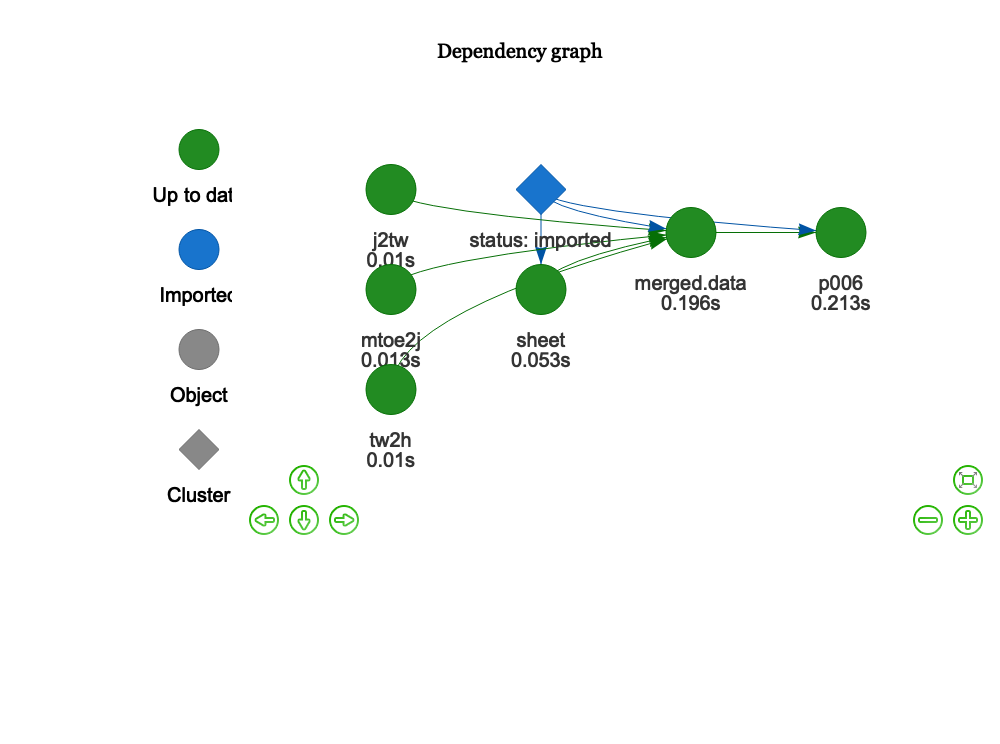
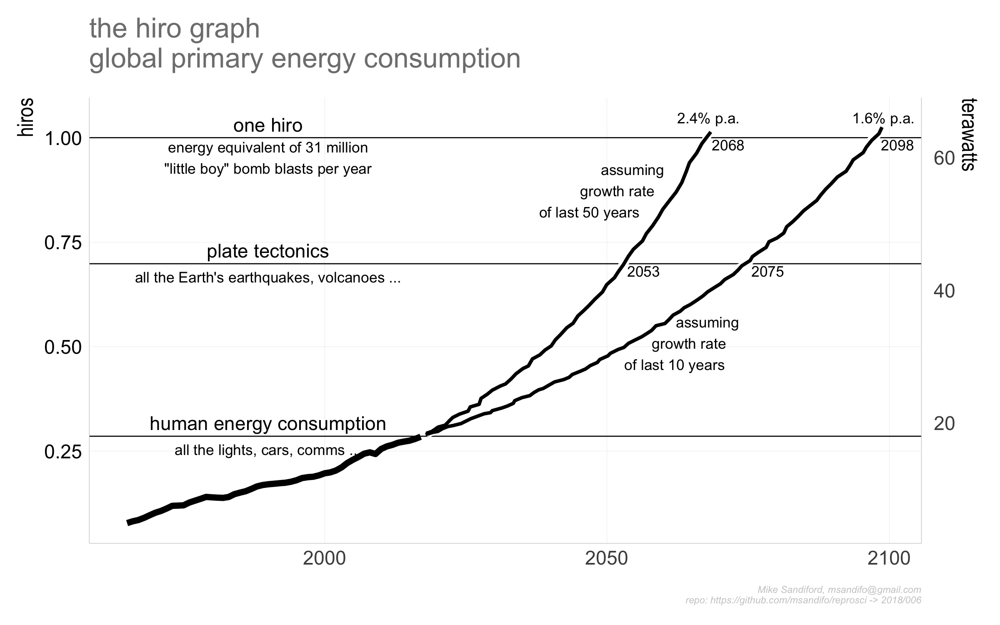

006
================

## The hiro graph

reprocessed from my original from circa 2009, when I started using the
term. See
<https://theconversation.com/our-effect-on-the-earth-is-real-how-were-geo-engineering-the-planet-1544>
for one of my first public references.

## Data Sources

  - [BP statistical-review of energy, 2018
    edition](https://www.bp.com/content/dam/bp/en/corporate/excel/energy-economics/statistical-review/bp-stats-review-2018-all-data.xlsx).
    The BP data is distributed as an Excel spreadsheet. Here I use the
    primary energy consumption data. To obtain the sheet number (=2) we
    apply `sheet = reproscir::BP_sheets(search
    =c("prim","consumption"))$sheet`

## Caveats

## Code

The code base is in `r` and is managed within RStudio, using the `drake`
package, and my `reoproscir` package on `github` obtained with
`devtools::install_github('msandifo/reproscir')`. *Note this package is
very much a work in progress, and while it is installed automagically if
not present, if it had been previously installed it will likely need
updating with* `devtools::install_github('msandifo/reproscir')`.

Future energy consumption projections are implemented with the function
`reproscir::project_cagr` (\_project with compounding annual growth
rate\_) which takes advantage of the wonderful functional programming
capabilities of the `purrr` package in the statement
`purrr::imap_dbl(rep(1,n), ~.x*((1.+ gr/100)^.y))` where `n` is the
length in years of the projection and `gr` is the annual growth
rate.\[1\]

The code can be executed by opening the `Rstudio` project `006.Rproj`
and sourcing `drake.R`.

``` r
source('drake.R')
```

Details of the steps invoked by `drake.R` are summarised below.

  - `source('./src/packages.R')` checks for and automatically installs
    missing package dependencies
    <!-- ```tidyverse```, ```ggplot2```, ```magrittr```, ```purrr```, ```stringr```, ```drake```, ```lubridate```, ```rvest```, ```rappdirs```,```data.table```, ```fasttime```, ```devtools```, ```wbstats```  -->
    <!--  from cran, and ```hrbrthemes```  and ```reproscir``` from the github repos ```hrbrmstr/hrbrthemes``` and ```msandifo/reproscir``` -->

  - `source('./src/settings.R')` sets variables, such as the
    `drake.path`,

  - `source('./src/functions.R')` reads any functions not in `reproscir`

  - `source('./src/theme.R')` sets a ggplot theme derived from
    `hrbrthemes`

  - `source('./src/plots.R')` plot functions

  - `source('./src/downloads.R')` directs the download of the relevant
    data files into a local directory set by `local.path`. By default
    `local.path=NULL` in which case data is downloaded via
    `rappdirs::user_cache_dir()` to a folder in the users cache
    directory (for macOSX, `~/Library/cache`) to `file.path(local.path,
    aemo)`. Data files will only be downloaded if not already.

  - `source('./src/plan.R')` defines the drake plan `reproplan`

  - `source('./src/ouputs.R')` potsprocessing output functions

The dependency structure of the reprplan is obtained by procesing as
follows

``` r
source('./src/settings.R')
source('./src/theme.R')
source('./src/functions.R')
source('./src/plots.R')
source('./src/plan.R')
drake::make( reproplan )
config <- drake::drake_config(reproplan)
graph <- drake::drake_graph_info(config, group = 'status', clusters = 'imported')
drake::render_drake_graph(graph, file='figs/rmd_render_drake.png')
```



Note that `reproplan` processes the files downloaded by
`./src/downloads.R`, returning `merged.data`

    ## # A tibble: 6 x 3
    ##    year region  value
    ##   <dbl> <chr>   <dbl>
    ## 1  1965 World  0.0779
    ## 2  1966 World  0.0822
    ## 3  1967 World  0.0853
    ## 4  1968 World  0.0905
    ## 5  1969 World  0.0966
    ## 6  1970 World  0.103

  - `source(drake::make( reproplan ))`
  - `source('./src/ouputs.R')` output charts to the `./figs` directory
:

<!-- end list -->

``` r
p006<-drake::readd(p006)
```



## Code Notes

\[1\] An alterative is using `haskell` like list comprehensions
implemented in `reposcir` as

``` r
cg.n<-reproscir::cagr( tail(drake::readd(merged.data),50))
reproscir::set[1*((1.+ cg.n/100)^x)| x <- 1:30, x ]
```

    ##  [1] 1.023663 1.047885 1.072681 1.098064 1.124047 1.150645 1.177872
    ##  [8] 1.205744 1.234275 1.263481 1.293379 1.323983 1.355313 1.387383
    ## [15] 1.420212 1.453818 1.488219 1.523435 1.559483 1.596385 1.634160
    ## [22] 1.672828 1.712412 1.752932 1.794411 1.836872 1.880337 1.924831
    ## [29] 1.970378 2.017002

following the approach suggetsed by [Konrad
Rudolph](https://gist.github.com/klmr/35a13344080e71bf8c34)

## Errata
