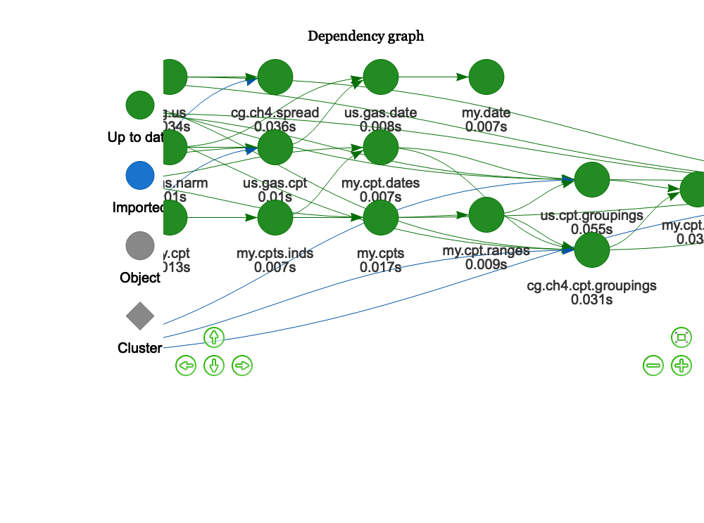
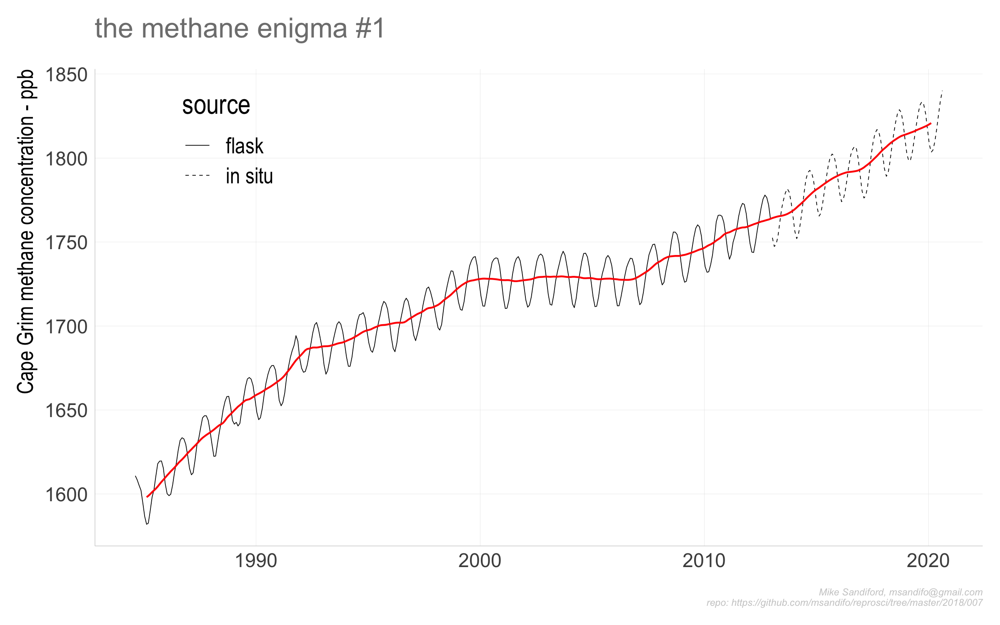
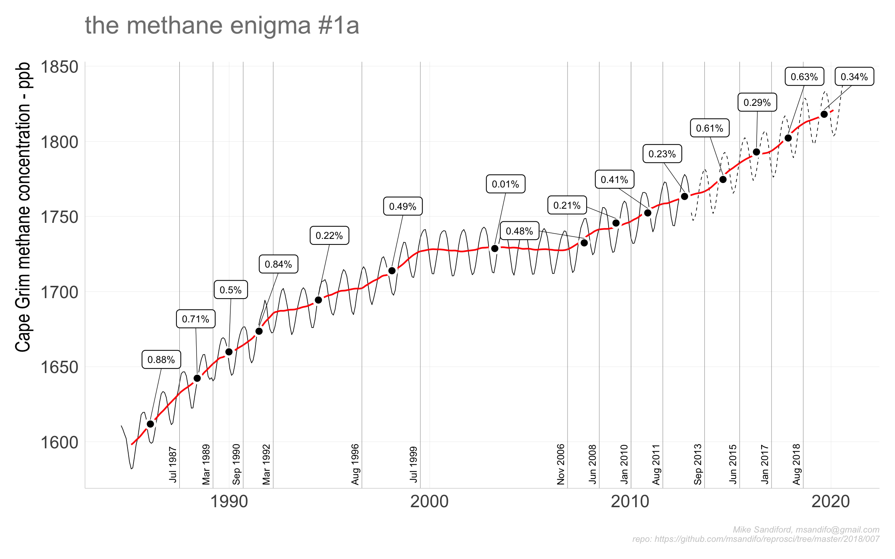
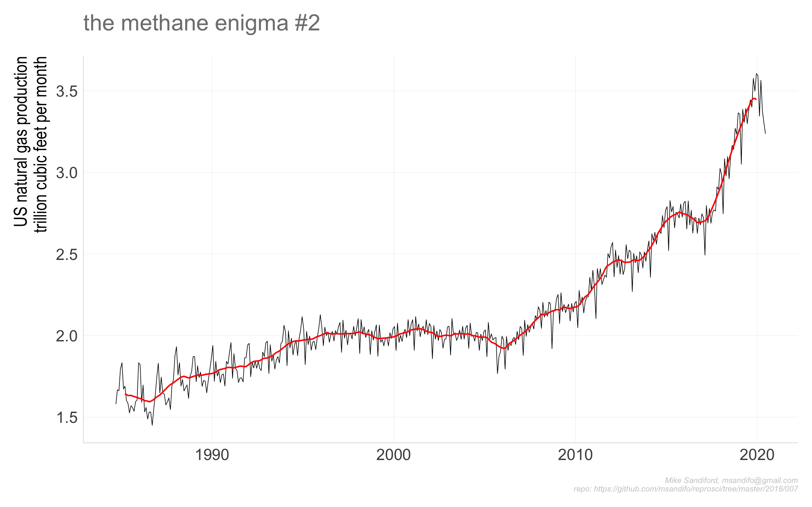
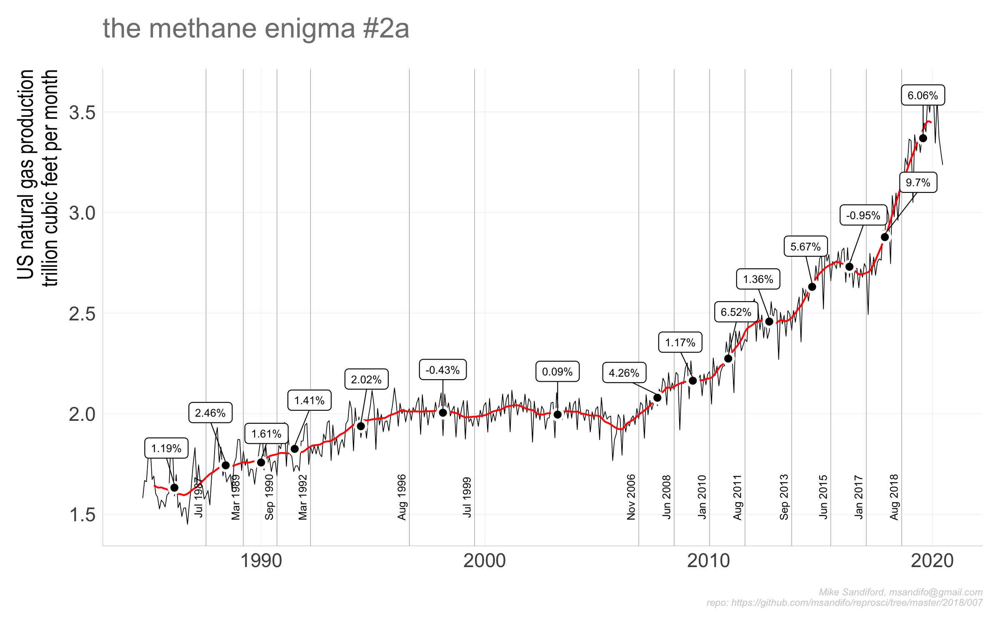
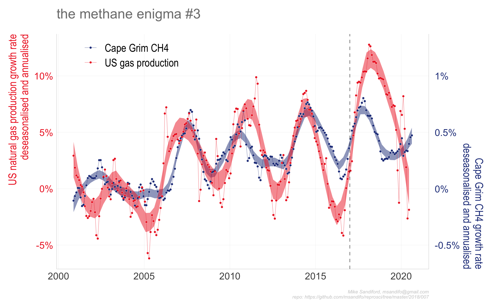
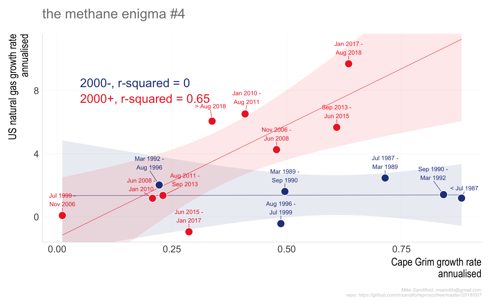

007
================

## The methane enigma

Since 2006, atmospheric methane levels have begun to rise alarmingly.
This follows a significant pause in growth from 2000-2005, and period of
reducing growth rates. The records from Australia’s Cape Grim
Observatory show the year on year growth September 2017 to September
2018 is 0.64% (cf 0.6 for CO2).
<!-- `{diff(rbind( tail(  cg.ch4,13) %>% head(1),tail( cg.ch4,1) )$value)/(tail(  cg.ch4,2) %>% head(1))$value*100` -->

To be added … Some notes about global warming potential.

The increase in growth rates after 2006 is dramatic and concerning, and
has been the subject of considerable discussion in recent literature.
The increase coincides in time with the remarkable developments in
*shale gas* (or *unconventinal gas*) production in the US, which have
seen a dramatic increase in US natural gas production as well as US
*unconventional oil* or *“tight” oil* production.

However, the causal relationship between the two is not at all clear,
because while atmospheric levels of methane have rise the isotopic ratio
of the methane has trended to lighter ratios (more negative C13/C12
ratios).

Noting that correlation is not causation, this post explores chnages in
the correlation between several datasets that make for a very
interesting reassessment of the.

There is a significant correlation between the *rate of growth* in CH4
and US gas production.

  - The correlation is not with the volume of gas produced, but the rate
    of increase in volume, which suggests any plausible causation must
    associate with the way gas fields are developed.

  - We might ask questions about what happens more broadly in the
    production cycle. For example *coal seam gas* (CSG) in the US has
    dramatically reduced production because of cost pressures from the
    shale gas.

## Data Sources

  - to be added

## Caveats

## Code

The code base is in `r` and is managed within RStudio, using the `drake`
package, and my `reoproscir` package on `github` obtained with
`devtools::install_github('msandifo/reproscir')`. *Note this package is
very much a work in progress, and while it is installed automagically,it
will likely need reinstalling with
*`devtools::install_github('msandifo/reproscir')`.

The code can be executed by opening the `Rstudio` project `007.Rproj`
and sourcing `drake.R`.

``` r
source('drake.R')
```

Details of the steps invoked by `drake.R` are summarised below.

  - `source('./src/packages.R')` checks for and automatically installs
    missing package dependencies
    <!-- ```tidyverse```, ```ggplot2```, ```magrittr```, ```purrr```, ```stringr```, ```drake```, ```lubridate```, ```rvest```, ```rappdirs```,```data.table```, ```fasttime```, ```devtools```, ```wbstats```  -->
    <!--  from cran, and ```hrbrthemes```  and ```reproscir``` from the github repos ```hrbrmstr/hrbrthemes``` and ```msandifo/reproscir``` -->

  - `source('./src/settings.R')` sets variables, such as the
    `drake.path`,

  - `source('./src/functions.R')` reads any functions not in `reproscir`

  - `source('./src/theme.R')` sets a ggplot theme derived from
    `hrbrthemes`

  - `source('./src/plots.R')` plot functions

  - `source('./src/downloads.R')` directs the download of the relevant
    data files to be downloaded into the local directory set by
    `local.path`. By default `local.path=NULL` in which case data is
    downloaded via `rappdirs::user_cache_dir()` to a folder in the users
    cache directory (for macOSX, `~/Library/cache`) to
    `file.path(local.path, aemo)`.

  - `source('./src/plan.R')` defines the drake plan `reproplan`

  - `source('./src/ouputs.R')` potsprocessing output functions

The dependency structure of the reprplan is obtained by procesing as
follows

``` r
source('./src/settings.R')
source('./src/theme.R')
source('./src/functions.R')
source('./src/plots.R')
source('./src/plan.R')
drake::make( reproplan )
config <- drake::drake_config(reproplan)
graph <- drake::drake_graph_info(config, group = 'status', clusters = 'imported')
drake::render_drake_graph(graph, file='figs/rmd_render_drake.png')
```



Note that `reproplan` processes the files downloaded by
`./src/downloads.R`, returning `merged.data`

  - `source(drake::make( reproplan ))`
  - `source('./src/ouputs.R')` output charts to the `./figs` directory
:

<!-- end list -->

``` r
p007<-drake::readd(p007)
```








## Code Notes

## Errata
