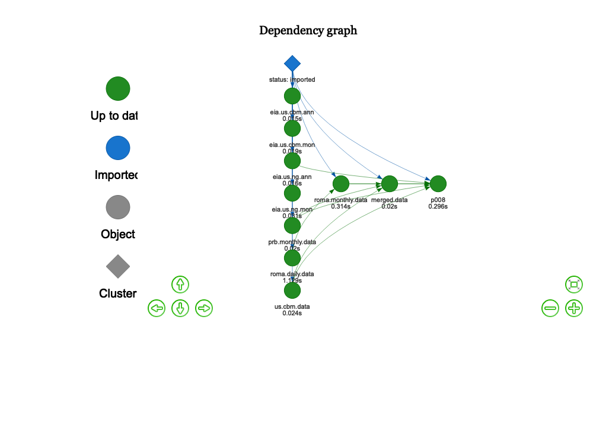
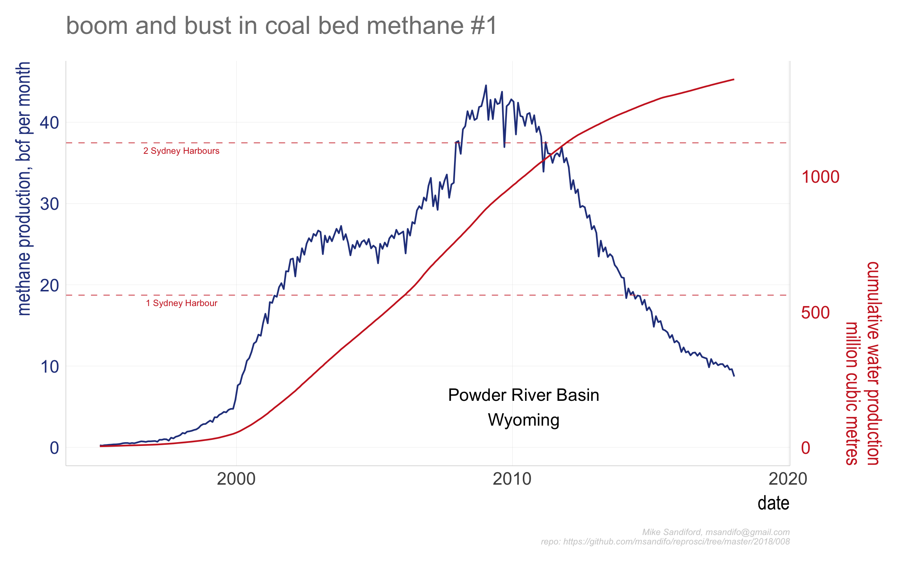
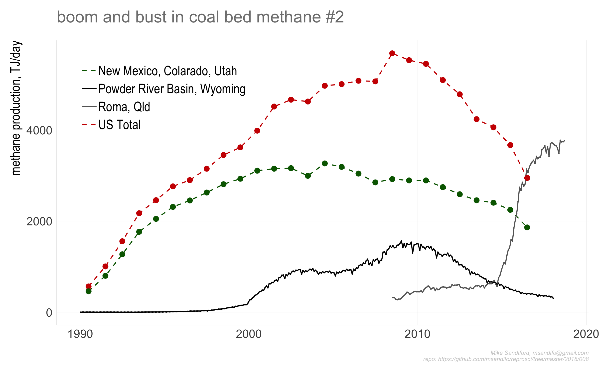
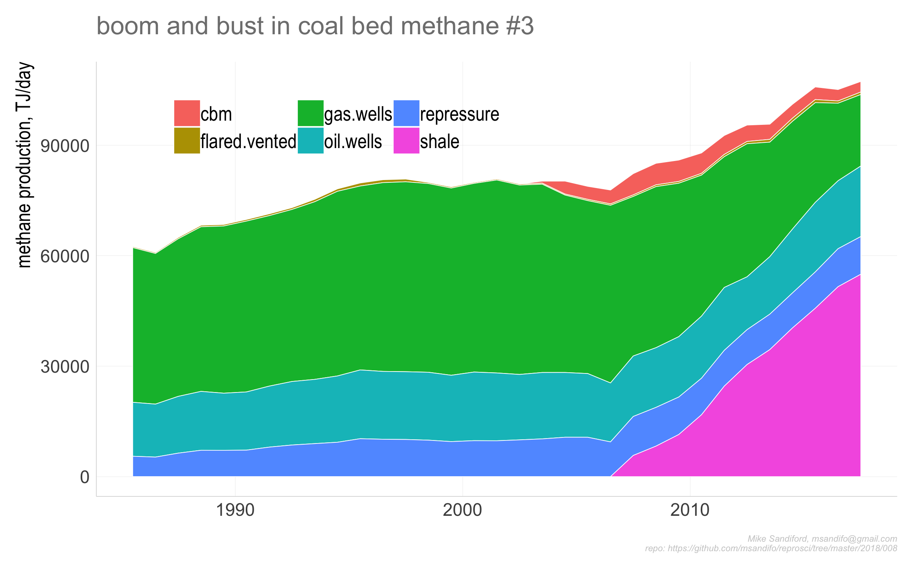
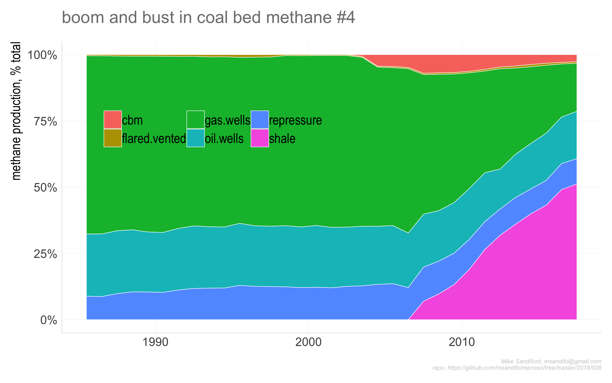
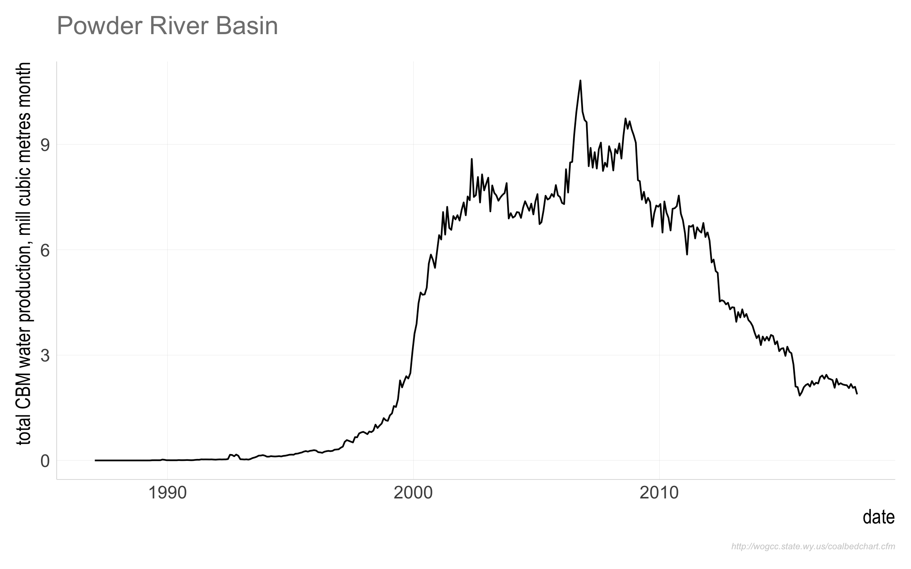

008
================

## U.S. Coal Bed methane - boom and bust

For a while, in the 1990’s and early 2000’s, coal bed methane was the
market darling for US gas producers. Producion in the Powder River Basin
in Wyoming and the San Juan Basin in the four corners skyrocketed. By
2008, CBM accounted for around 8% of the US methane production.

But the last 10 years have not been kind fro CBM investors, with CBM
fields progressively losing market share to shale gas the rise of which
has been simply extraordinary since 2006. Shale gas now makes up for
more than 50% of total US gas production, and has rendered the CBM
basins as heartbreak country. PPRB CBM production has dropped to just
20% of its peak in just 10 years.

In the mid 200’ there were over 20000 CBM wells, increasing at a rate of
more than 2000 a year. The story of demise is documented in [Coalbed
Methane: Boom, Bust and Hard
Lessons](https://www.wyohistory.org/encyclopedia/coalbed-methane-boom-bust-and-hard-lessons)

As at mid November, 2018, there were 3584 abandoned or orphaned wells,
left unplugged, on watch.

However it is swings and roundabouts for the PRB in eastern Wyoming,
with the [next
boom](https://www.nytimes.com/2018/10/27/climate/trump-fracking-drilling-oil-gas.html)
having already left the station, albeit with a few hiccups.

see also
[here](https://trib.com/business/energy/ultra-petroleum-eyes-horizontal-in-wyoming-s-pinedale-field/article_646672a1-e15a-5e1b-accb-c7d8ee93fece.html#tncms-source=infinity-scroll-summary-siderail-latest)
and
[here](https://www.bloomberg.com/opinion/articles/2018-09-10/powder-river-basin-shale-oil-is-having-a-moment)

## Data Sources

  - Powder River cbm/csg production data from the Wyoming survey
  - EIA

## Caveats

The data file `powder.river.source.csv` is manually constructed from
data provided by Wyoming Oil and Gas Conservation Commission following
the recipe below

go to \~~~<http://wogcc.state.wy.us/coalbedchart.cfm>~~\~
<http://pipeline.wyo.gov/legacywogcce.cfm>

follow links \* data \* coal bed \* coal bed production \* coal bed
production by month (PRB only)

update `powder.river.source.csv` by copy and paste any additional date
items from the bottom of the web table.

## Code

The code base is in `r` and is managed within RStudio, using the `drake`
package, and my `reoproscir` package on `github` obtained with
`devtools::install_github('msandifo/reproscir')`. *Note this package is
very much a work in progress, and while it is installed automagically,it
will likely need reinstalling with
*`devtools::install_github('msandifo/reproscir')`.

The code can be executed by opening the `Rstudio` project `008.Rproj`
and sourcing `drake.R`.

``` r
source('drake.R')
```

Details of the steps invoked by `drake.R` are summarised below.

  - `source('./src/packages.R')` checks for and automatically installs
    missing package dependencies
    <!-- ```tidyverse```, ```ggplot2```, ```magrittr```, ```purrr```, ```stringr```, ```drake```, ```lubridate```, ```rvest```, ```rappdirs```,```data.table```, ```fasttime```, ```devtools```, ```wbstats```  -->
    <!--  from cran, and ```hrbrthemes```  and ```reproscir``` from the github repos ```hrbrmstr/hrbrthemes``` and ```msandifo/reproscir``` -->

  - `source('./src/settings.R')` sets variables, such as the
    `drake.path`,

  - `source('./src/functions.R')` reads any functions not in `reproscir`

  - `source('./src/theme.R')` sets a ggplot theme derived from
    `hrbrthemes`

  - `source('./src/plots.R')` plot functions

  - `source('./src/downloads.R')` directs the download of the relevant
    data files to be downloaded into the local directory set by
    `local.path`. By default `local.path=NULL` in which case data is
    downloaded via `rappdirs::user_cache_dir()` to a folder in the users
    cache directory (for macOSX, `~/Library/cache`) to
    `file.path(local.path, aemo)`.

  - `source('./src/plan.R')` defines the drake plan `reproplan`

  - `source('./src/ouputs.R')` potsprocessing output functions

The dependency structure of the reprplan is obtained by procesing as
follows

``` r
source('./src/settings.R')
source('./src/theme.R')
source('./src/functions.R')
source('./src/plots.R')
source('./src/plan.R')
drake::make( reproplan )
config <- drake::drake_config(reproplan)
graph <- drake::drake_graph_info(config, group = 'status', clusters = 'imported')
drake::render_drake_graph(graph, file='figs/rmd_render_drake.png')
```



Note that `reproplan` processes the files downloaded by
`./src/downloads.R`, returning `merged.data`

    ##         date       val                      region
    ## 1 1987-01-15 0.7630902 Powder River Basin, Wyoming
    ## 2 1987-02-15 1.1155950 Powder River Basin, Wyoming
    ## 3 1987-03-15 0.5803335 Powder River Basin, Wyoming
    ## 4 1987-04-15 0.7169105 Powder River Basin, Wyoming
    ## 5 1987-05-15 0.4273926 Powder River Basin, Wyoming
    ## 6 1987-06-15 1.0942934 Powder River Basin, Wyoming

  - `source(drake::make( reproplan ))`
  - `source('./src/ouputs.R')` output charts to the `./figs` directory
:

<!-- end list -->

``` r
p008<-drake::readd(p008)
```

<figure>



<figcaption>

Fig. 1. Gas production (bilion cubic feet per month) and cumulative
water production (million cubic meters), Powder River Basin,
Wyoming.

</figcaption>

</figure>

<figure>



<figcaption>

.

</figcaption>

</figure>

<figure>



<figcaption>

.

</figcaption>

</figure>

<figure>



<figcaption>

.

</figcaption>

</figure>

<figure>



<figcaption>

G .

</figcaption>

</figure>

## Code Notes

## Errata
