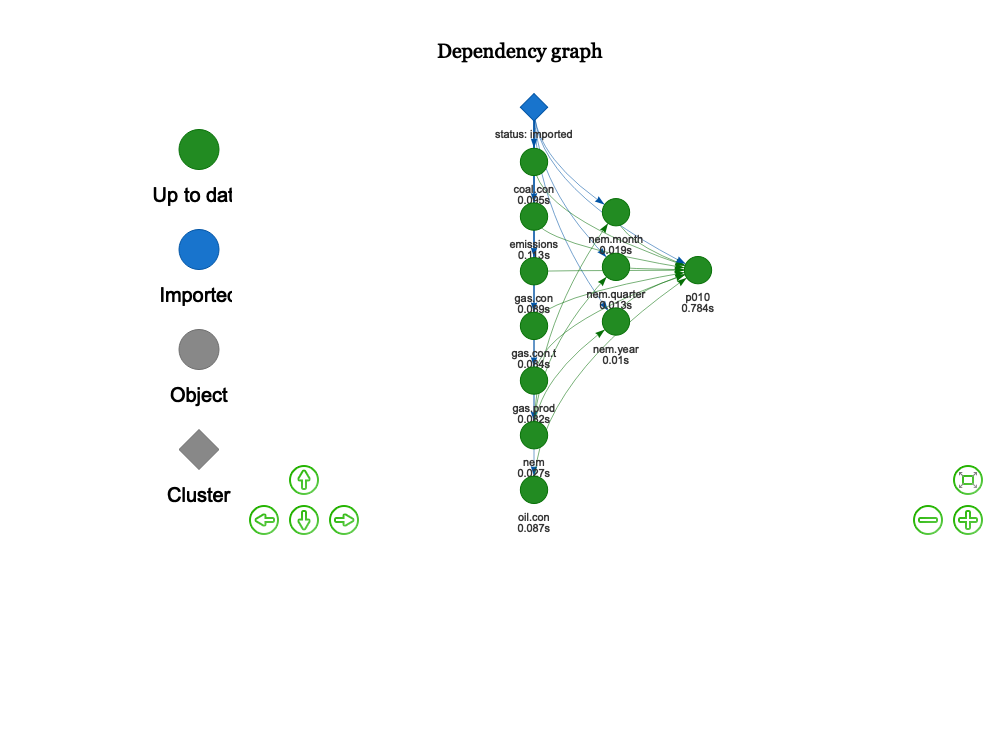
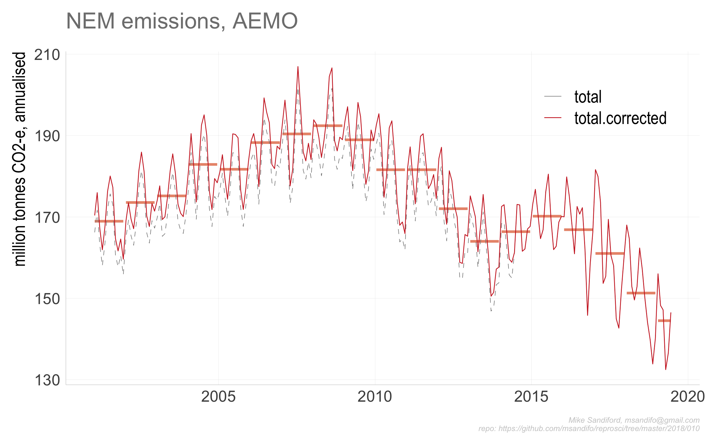
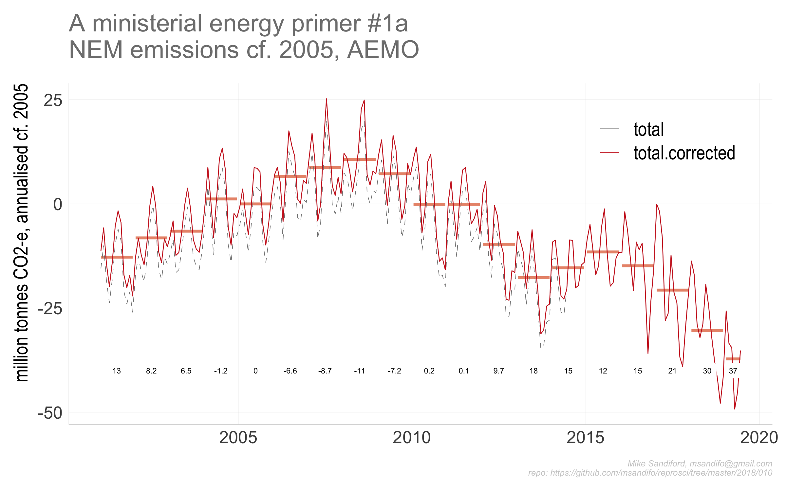
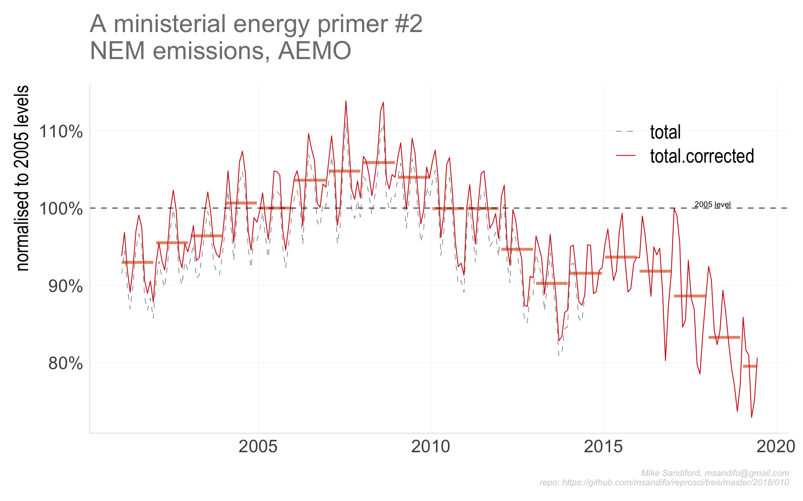
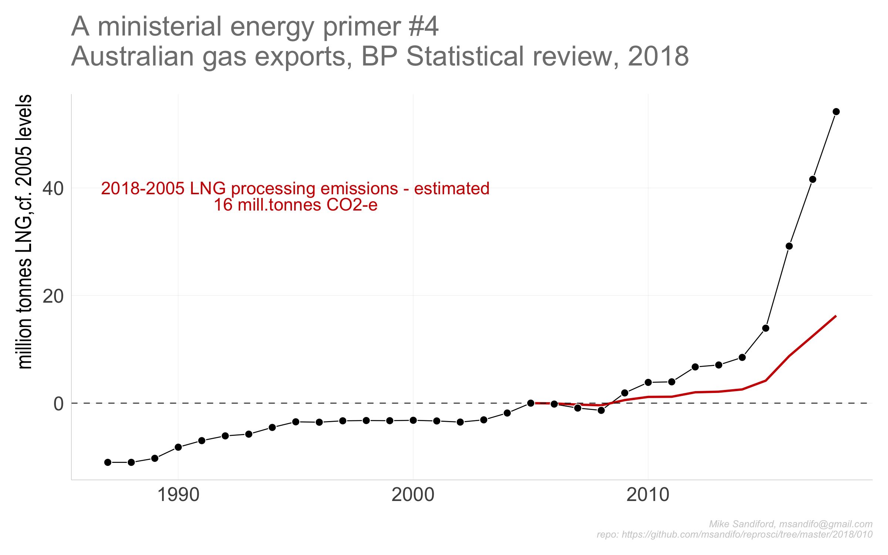

```{r setup, include=FALSE}
knitr::opts_chunk$set(echo = FALSE,  message=FALSE, warning=FALSE)
drake.path<-'~/Dropbox/msandifo/documents/programming/r/twitter/2018/010/'
full.repro<-F
library(reproscir)
source('./src/settings.R')
source('./src/theme.R')
source('./src/functions.R')
source('./src/plan.R')
source('./src/downloads.R')
```

##  Australian energy emissions and consumption snapshots

Including demand for electricty in the NEM (Austrlaian east coast electricity market supplying around ~80% of Australians)

## Data Sources

* AEMO
* BP Statistical Review of World Energy
* ...

##  Caveats

* AEMO emsiisons are preprocessed applying a correction factor of +2.5% applied to recorded valeus prior to 2105. following a change in methodology reported here)

## Code

The code base is in ```r``` and is managed  within RStudio, using  the  ```drake```  package, and my ```reoproscir``` package on ```github```  obtained with ```devtools::install_github('msandifo/reproscir')```. _Note this package is very much a  work in progress, and while it  is installed automagically,it will likely need reinstalling with _```devtools::install_github('msandifo/reproscir')```.

The code can be executed by opening the ```Rstudio``` project  ```010.Rproj```
and sourcing ```drake.R```.

```{r echo=T, eval=F}
source('drake.R')
```
Details of the steps invoked by ```drake.R``` are summarised below.

* `source('./src/packages.R')` checks for and automatically installs missing package dependencies
<!-- ```tidyverse```, ```ggplot2```, ```magrittr```, ```purrr```, ```stringr```, ```drake```, ```lubridate```, ```rvest```, ```rappdirs```,```data.table```, ```fasttime```, ```devtools```, ```wbstats```  -->
<!--  from cran, and ```hrbrthemes```  and ```reproscir``` from the github repos ```hrbrmstr/hrbrthemes``` and ```msandifo/reproscir``` -->

* `source('./src/settings.R')` sets variables, such as the ```drake.path```,
* `source('./src/functions.R')` reads any functions not in ```reproscir```
* `source('./src/theme.R')`  sets a ggplot theme derived from ```hrbrthemes```
* `source('./src/plots.R')` plot functions
* `source('./src/downloads.R')` directs the download of the  relevant data files to be downloaded  into the local directory set by
``` local.path```. By default ``` local.path=NULL``` in which case data is downloaded via ```rappdirs::user_cache_dir()``` to a folder in the users cache directory (for macOSX, ```~/Library/cache```) to ```file.path(local.path, aemo)```.


* `source('./src/plan.R')` defines the drake plan ```reproplan```
* `source('./src/ouputs.R')` potsprocessing output functions

The dependency structure of the reproplan is obtained by processing as follows
```{r drake_plan, echo=TRUE, cache=F}
source('./src/settings.R')
source('./src/theme.R')
source('./src/functions.R')
source('./src/plots.R')
source('./src/plan.R')
drake::make( reproplan )
config <- drake::drake_config(reproplan)
graph <- drake::drake_graph_info(config, group = 'status', clusters = 'imported')
drake::render_drake_graph(graph, file='figs/rmd_render_drake.png')
```



Note that ```reproplan``` processes the files downloaded  by ```./src/downloads.R```, returning ```merged.data```
```{r  cache=FALSE}
#print(head(readd(merged.data)))

```

* ```source(drake::make( reproplan ))```
* ```source('./src/ouputs.R')```
output charts  to the ```./figs``` directory :

```{r  echo=TRUE, cache=TRUE, eval=F}
p010<-drake::readd(p010)

 ```




   

  
   
   Australian gas consumption is rising  becaus eof LNG production, with  around 8-12% of new production is "consumed" in liquefaction etc. For every 1 tonne of LNG exported that adds about 0.3 tonnes to domestic emissions (molecular weight of CO2=44, CH4=16)
 

 
   With BP estimating LNG exports at  75.9 bcm (= 55 million tonnes),  that gives yields a total of 17 million tinnes CO2 emissions, with an increase  of 12 million tonnes over 2005 levels.

 

## Code Notes

## Errata
