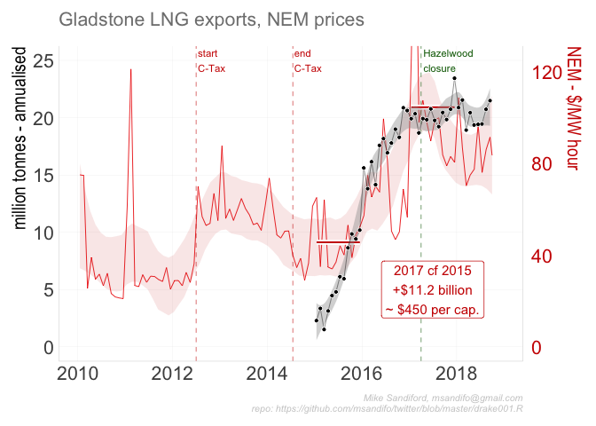
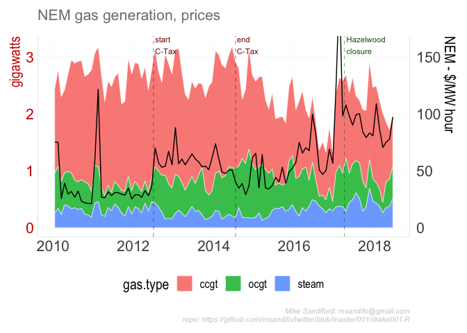

001-Gladstone LNG
================

## Sources

Dat is sourced from Gladstone Port authority using rvest, and from AEMO
dipsatch files by region id

## Getting the data

### Gladstone Port Authority

we use rvest to acces the Gladstone Port authority, with the function
read\_gladstone\_ports(year, month, fuel, country)

``` r
 read_gladstone_ports<- function(year=NULL, 
                                 month=NULL,
                                 fuel="Liquefied Natural Gas",
                                 country="Total"){
   if (is.null(year)) year <- lubridate::year(Sys.Date())
  if (is.null(month)) {
    current.month <- lubridate::month(Sys.Date())
    #current month not posted (usually not posted until second week of current month)
 
    if (m>1) month <- current.month <- 1  else {
      month=12
      year<-year-1
      }
  }
   if (month>= 10) yearmonth= paste(year,month, sep="") else 
     yearmonth= paste(year,month, sep="0")
   message(paste(fuel, month, year))
   url<-paste0("http://content1.gpcl.com.au/viewcontent/CargoComparisonsSelection/CargoOriginDestination.aspx?View=C&Durat=M&Key=",yearmonth)
   wg <- rvest::html_session(url )
   batches <- rvest::read_html(wg) %>%
     rvest::html_nodes("#MainContent_pnlResults")   #class(batches)
   table <- batches %>%
     rvest::html_nodes("td") %>%
     rvest::html_text()
   lng.ind <- which( table==fuel)
   t.ind <-which(str_detect(table,country))
   t.lng.ind  <- t.ind[t.ind>lng.ind][1]
   value <- table[t.lng.ind+1] %>% str_replace_all(",","") %>%as.numeric()
   mdays <- lubridate::days_in_month(lubridate::ymd(paste(year,month, "01", sep="-")))
   if(country=="Total"){
     ships <- table[t.lng.ind+2] %>% str_replace_all(",","") %>%as.numeric()
     return(data.frame(year=year, 
                       month=month, 
                       date=lubridate::ymd(paste(year,month, "15", sep="-")),
                       tonnes=value, 
                       shipments=ships, 
                       mdays=mdays))
   } else 
     return(data.frame(year=year, 
                       month=month,  
                       date=lubridate::ymd(paste(year,month, "15", sep="-")),
                       tonnes=value,
                       mdays=mdays))
 }
```

## Code

The doe is oragsisned anbd run via a drake plan

## Output

The code geneartes :

<!-- -->

You can also embed plots, for example:

<!-- -->

Note that the `echo = FALSE` parameter was added to the code chunk to
prevent printing of the R code that generated the plot.

## Errata
