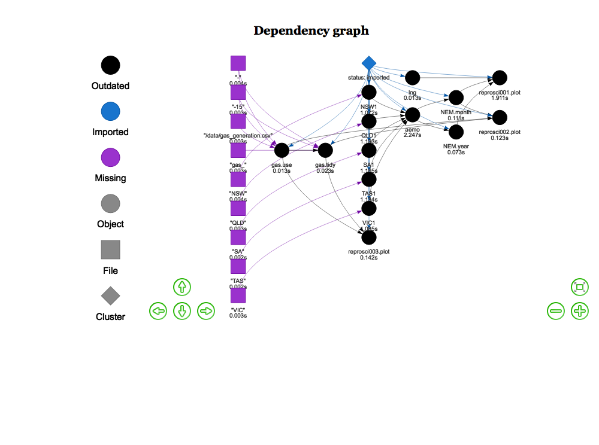

```{r setup, include=FALSE}
knitr::opts_chunk$set(echo = FALSE,  message=FALSE, warning=FALSE)
 source('./src/theme.R')
source('./src/functions.R')

```

## Summary

Amongst the many factors that caused Australian east coast electricity wholesale prices to double ind 2016 was the opening of the east coast gas market to internatinal LNG exports, via the Port of Gladstone. 
Here I explore  atime series of Gladstone Port Authority LNG export volumes, and NEM market dispatch prices to illustrate the correlations.
LNG exports are expresed in annualised tonneage. NEM market prices are in AUD$ per megawatt hour.

## Package dependencies

## Data Sources

LNG epxorts data are sourced from the [Gladstone Port Authority (GPA)  website](http://content1.gpcl.com.au/viewcontent/CargoComparisonsSelection/CargoComparisonsSelection.aspx). 

NEM electricity prices are sourced from AEMO's half hourly price and demand csv files.


## Code

The code base is in ```r``` and is best managed with in managed within RStudio, using   the ```drake``` package.

#### Package dependencies

If not already installed, sourcing ```'./src/functions.R'``` automatically installs the package dependencies 
```tidyverse```, ```ggplot2```, ```magrittr```, ```purrr```, ```stringr```, ```drake```, ```lubridate```, ```rvest```, ```rappdirs```,```data.table```, ```fasttime```, ```devtools```, ```wbstats``` 
 from cran, and ```hrbrthemes``` from the github repo ```hrbrmstr/hrbrthemes```.


#### Setup

To start we  set some variables, such as the ```drake.path```, read in key functions (including the drake plan ```reproplan```) and adjust the ggplot theme.

```{r echo=T, eval=F}
pkgconfig::set_config("drake::strings_in_dots" = "literals")
local.path=NULL
drake.path <- dirname(rstudioapi::getSourceEditorContext()$path )
setwd(drake.path)
source('./src/theme.R')
source('./src/functions.R')
source('./src/plan.R')

``` 

#### Downloads
 
```{r echo=T, eval=F} 
source('./src/downloads.R')
``` 

directs the downlaod of the  AEMO csv data files to be downloaded  into the local directory set by 
``` local.path```
By default ``` local.path=NULL``` in which case data is downloaded via ```rappdirs::user_cache_dir()``` to a folder in the users cache directory (for macOSX, ```~/Library/cache```) to ```file.path(local.path, aemo)```.  ```'./src/downloads.R'```  is a wrapper on the function calls

```{r echo=T, eval=F}
download_aemo_aggregated(year=2010:2018, months=1:12, local.path=local.path)
download_aemo_current( local.path=local.path )
```


#### Drake plan

The code is organised and run/update via drake plan ```reproplan```` ( sourced via ```source('./src/downloads.R')```)

```{r echo=T, eval=F}
drake::make( reproplan, force=T)
```

The drake ```reproplan``` dependency structure can be easily visualised 
```{r drake_plan, echo=TRUE, cache=TRUE}
config <- drake::drake_config(reproplan001)
graph <- drake::drake_graph_info(config, group = "status", clusters = "imported")
drake::render_drake_graph(graph, file="figs/rmd_render_drake.png")
```




Note that the drake plan ```reproplan``` includes 

* the directive ```lng = update_gladstone( local.path=local.path)``` which either reads the Gladstone export data from html tables as a data.frame  and stores ```lng``` to disk in   ```load(file.path(validate_directory(local.path, "gladstone"), "lng.Rdata"))``` or, if already downloaded, ```load(file.path(validate_directory(local.path, "gladstone"), "lng.Rdata"))```- see code details.


* statements to read the monthly AEMO csv files for each of the five NEM regions (NSW1, QLD1, SA1 TAS1, VIC1), and aggregate them as monthly ```NEM.month``` and annual ```NEM.year``` timeseries. 

```{r  cache=TRUE}
print(head(readd(NEM.month)))
```

```{r  cache=TRUE}
print(head(readd(NEM.year)))
```


#### Output

The code generates three charts, output to ```./figs``` directory :

```{r  echo=TRUE, cache=TRUE}
 
ggsave("./figs/reprosci001.png",  drake::readd(reprosci001.plot) ,width=8, height=5) 
ggsave("./figs/reprosci002.png",  drake::readd(reprosci002.plot) ,width=8, height=5) 
ggsave("./figs/reprosci003.png",  drake::readd(reprosci003.plot) ,width=8, height=5) 
```


```{r repo001, echo=T }
drake::readd(reprosci001.plot)
```


```{r repo002, echo=T}
drake::readd(reprosci002.plot)
```

```{r repo003, echo=T}
drake::readd(reprosci003.plot)
```

## Code details

### Gladstone Port Authority (GPA)

The function call

``` read_gladstone_ports<- function(year=NULL, month=NULL,fuel="Liquefied Natural Gas", country="Total")```

scrapes data from the GPA html tables, utilising the package ```rvest```, noting that other commodities exported through the GPA, such as ```"Coal"```, can also be specified.

In our drake file, ```read_gladstone_ports``` is only indirectly clled via the function ```update_gladstone```

## Errata
