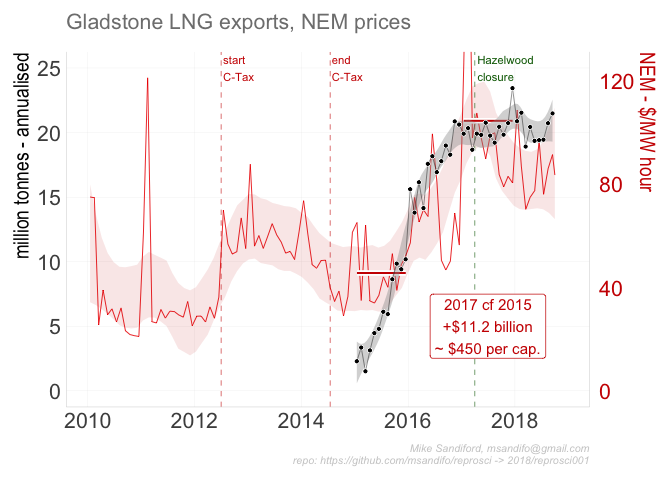
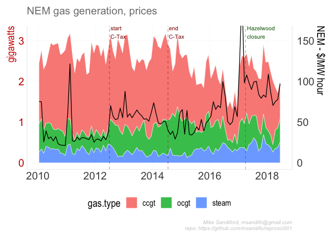
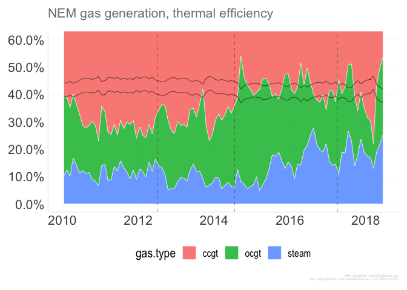

001-Gladstone LNG
================

## Summary

Amongst the many factors that caused Australian east coast electricity
wholesale prices to double between 2015 and 2016, is the opening of the
east coast gas market to internatinal exports. Here I explore time
series of Gladstone Port Authority LNG export volumes, and NEM market
dispatch prices to illustrate the correlations. LNG exports are expresed
in annualised tonneage. NEM market prices are in AUD$ per megawatt hour.

## Package dependencies

## Data Sources

LNG epxorts data are sourced from the [Gladstone Port Authority (GPA)
website](http://content1.gpcl.com.au/viewcontent/CargoComparisonsSelection/CargoComparisonsSelection.aspx).

NEM electricity prices are sourced from AEMO’s half hourly rpice and
demand files.

## Code

The code base in managed using the `drake` package.

To start we set some variables, such as the `drake.path`, read in key
functions (including the drake plan `reproplan`) and adjust the ggplot
theme.

``` r
pkgconfig::set_config("drake::strings_in_dots" = "literals")
local.path=NULL
drake.path <- dirname(rstudioapi::getSourceEditorContext()$path )
setwd(drake.path)
source('./src/theme.R')
source('./src/functions.R')
source('./src/plan.R')
```

#### Downloads

``` r
source('./src/downloads.R')
```

directs the downlaod of the AEMO csv data files to be downloaded into
the local directory set by `local.path` By default `local.path=NULL` in
which case data is downloaded via `rappdirs::user_cache_dir()` to a
folder in the users cache directory (for macOSX, `~/Library/cache`) to
`file.path(local.path, aemo)`. `'./src/downloads.R'` is a wrapper on the
function
calls

``` r
download_aemo_aggregated(year=2010:2018, months=1:12, local.path=local.path)
download_aemo_current( local.path=local.path )
```

#### Drake plan

The code is organised and run/update via drake plan `reproplan```` (
sourced via`source(‘./src/downloads.R’)\`\`\`)

``` r
drake::make( reproplan, force=T)
```

The drake `reproplan` dependency structure can be easily visualised

``` r
config <- drake::drake_config(reproplan001)
graph <- drake::drake_graph_info(config, group = "status", clusters = "imported")
drake::render_drake_graph(graph, file="figs/rmd_render_drake.png")
```


Note that the drake plan `reproplan` includes

  - the directive `lng = update_gladstone( local.path=local.path)` which
    either reads the Gladstone export data from html tables as a
    data.frame and stores `lng` to disk in
    `load(file.path(validate_directory(local.path, "gladstone"),
    "lng.Rdata"))` or, if already downloaded,
    `load(file.path(validate_directory(local.path, "gladstone"),
    "lng.Rdata"))`- see code details.

  - statements to read the monthly AEMO csv files for each of the five
    NEM regions (NSW1, QLD1, SA1 TAS1, VIC1), and aggregate them as
    monthly `NEM.month` and annual `NEM.year` timeseries.

<!-- end list -->

    ## # A tibble: 6 x 5
    ## # Groups:   year [1]
    ##    year month date         RRP TOTALDEMAND
    ##   <dbl> <dbl> <date>     <dbl>       <dbl>
    ## 1  2010     1 2010-01-16  75.1      23918.
    ## 2  2010     2 2010-02-14  74.8      24549.
    ## 3  2010     3 2010-03-16  25.6      23265.
    ## 4  2010     4 2010-04-15  39.0      22157.
    ## 5  2010     5 2010-05-16  29.5      23156.
    ## 6  2010     6 2010-06-15  31.7      24560.

    ## # A tibble: 6 x 4
    ##    year date         RRP TOTALDEMAND
    ##   <dbl> <date>     <dbl>       <dbl>
    ## 1  2010 2010-07-02  35.3      23330.
    ## 2  2011 2011-07-02  39.4      22925.
    ## 3  2012 2012-07-01  44.7      22314.
    ## 4  2013 2013-07-02  60.4      21753.
    ## 5  2014 2014-07-02  47.8      21501.
    ## 6  2015 2015-07-02  45.7      21746.

#### Output

The code generates three charts, output to `./figs` directory :

``` r
setwd("./figs")
ggsave("reprosci001.png",  readd(reprosci001.plot) ,width=8, height=5) 
ggsave("reprosci002.png",  readd(reprosci002.plot) ,width=8, height=5) 
ggsave("reprosci003.png",  readd(reprosci003.plot) ,width=8, height=5) 
```

<!-- -->

<!-- -->

<!-- -->

## Code details

### Gladstone Port Authority (GPA)

The function call

`read_gladstone_ports<- function(year=NULL, month=NULL,fuel="Liquefied
Natural Gas", country="Total")`

scrapes data from the GPA html tables, utilising the package `rvest`,
noting that other commodities exported through the GPA, such as
`"Coal"`, can also be specified.

In our drake file, `read_gladstone_ports` is only indirectly clled via
the function `update_gladstone`

## Errata
